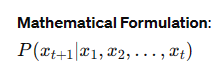

>I am trying a to create a repository that contains the most asked questions in the field of Generative AI.
The questions should be of the level of a Gen Ai architect who is supposed to be an expert in the fild of Generative AI.
Help me create 50 such questions.
Put the questions in suitable headers and subheaders.
Put the questions in in a decreasing order of the likeliness of being asked. Keeping the most important question first.
Make sure the questions are of the level that AI companies like nvidia, Microsoft, AWS, OpenAI and Google ask in theiir interviews.


# General Concepts of Generative AI
-----

## **What are foundational Models in Generative AI?**

Foundational models in Generative AI are large-scale models that are pre-trained on vast amounts of data and can be fine-tuned for a wide range of downstream tasks. These models serve as the basis for various applications in natural language processing (NLP), computer vision, and other AI domains. They leverage extensive pre-training to capture general patterns and knowledge, making them highly versatile and powerful for generative tasks.

### Key Characteristics of Foundational Models

1. **Large-Scale Pre-Training**: Foundational models are pre-trained on massive datasets, often using unsupervised or self-supervised learning techniques. This extensive pre-training enables them to learn a wide array of features and patterns from the data.
2. **Versatility**: These models can be fine-tuned or adapted for various specific tasks, such as text generation, translation, summarization, image generation, and more.
3. **Transfer Learning**: By leveraging the knowledge gained during pre-training, foundational models can be fine-tuned on smaller, task-specific datasets, achieving high performance with less data and training time.
4. **Architecture**: Many foundational models are based on the Transformer architecture, which excels at capturing long-range dependencies and parallel processing.

### Prominent Foundational Models

#### 1. GPT (Generative Pre-trained Transformer)

- **Architecture**: Decoder-only Transformer architecture.
- **Pre-training**: Predict the next word in a sentence (autoregressive).
- **Applications**: Text generation, question answering, code generation, and more.
- **Example**: GPT-3, which has 175 billion parameters.

| **Feature** | **Details** |
|-------------|-------------|
| Model       | GPT-3       |
| Parameters  | 175 billion |
| Use-Cases   | Text generation, code completion, summarization |

#### 2. BERT (Bidirectional Encoder Representations from Transformers)

- **Architecture**: Encoder-only Transformer architecture.
- **Pre-training**: Masked language modeling (predicting masked words) and next sentence prediction.
- **Applications**: Text classification, sentiment analysis, named entity recognition, and more.
- **Example**: BERT-base with 110 million parameters.

| **Feature** | **Details**         |
|-------------|---------------------|
| Model       | BERT-base           |
| Parameters  | 110 million         |
| Use-Cases   | Text classification, question answering, NER |

#### 3. DALL-E

- **Architecture**: Uses a version of GPT adapted for image generation.
- **Pre-training**: Text-to-image generation by learning from text-image pairs.
- **Applications**: Generating images from textual descriptions.
- **Example**: DALL-E 2.

| **Feature** | **Details**                    |
|-------------|--------------------------------|
| Model       | DALL-E 2                       |
| Parameters  | Not publicly disclosed         |
| Use-Cases   | Image generation from text     |

#### 4. CLIP (Contrastive Language–Image Pre-training)

- **Architecture**: Combines text and image encoders (based on Transformers).
- **Pre-training**: Learn to match images with their corresponding captions.
- **Applications**: Image classification, zero-shot learning, and multimodal tasks.
- **Example**: CLIP model.

| **Feature** | **Details**             |
|-------------|-------------------------|
| Model       | CLIP                    |
| Parameters  | Not publicly disclosed  |
| Use-Cases   | Zero-shot image classification, image search |

### Advantages of Foundational Models

1. **Efficiency**: Fine-tuning a pre-trained foundational model on a specific task requires significantly less data and computational resources compared to training a model from scratch.
2. **Performance**: These models often achieve state-of-the-art performance across a wide range of tasks due to their extensive pre-training.
3. **Flexibility**: They can be adapted for multiple tasks, making them highly versatile.
4. **Knowledge Transfer**: Knowledge learned from large-scale pre-training can be transferred to various domains and applications.

### Example: GPT-3 Detailed Breakdown

**GPT-3 Architecture**

GPT-3 uses a decoder-only Transformer architecture. Here's a high-level breakdown of its components:

1. **Self-Attention Mechanism**: Allows each token to attend to all previous tokens.
2. **Feed-Forward Neural Networks**: Applied to each token independently to process information.
3. **Layer Normalization**: Ensures stable training by normalizing inputs to each sub-layer.
4. **Residual Connections**: Help in gradient flow and allow for deeper networks.

**GPT-3 Training Process**

Really good Source on LLM training:

https://www.linkedin.com/pulse/discover-how-chatgpt-istrained-pradeep-menon/

1. **Pre-training**: Trained on diverse internet text using unsupervised learning to predict the next word in a sequence.
2. **Fine-tuning**: Adapted to specific tasks using supervised learning with labeled data.

**GPT-3 Use-Cases**

| **Use-Case**       | **Description**                                                | **Example**                                             |
|--------------------|----------------------------------------------------------------|---------------------------------------------------------|
| Text Generation    | Generate coherent and contextually relevant text              | Writing essays, articles, creative content              |
| Code Generation    | Assist in coding by generating code snippets and completions   | GitHub Copilot                                          |
| Question Answering | Answer questions based on context                              | Chatbots, virtual assistants                            |
| Translation        | Translate text from one language to another                    | Translating documents, real-time translation services   |

### Challenges and Considerations

1. **Bias and Fairness**: Foundational models can inherit biases present in their training data, which can lead to biased outputs.
2. **Resource-Intensive**: Training these models requires substantial computational resources and large datasets.
3. **Interpretability**: Understanding and interpreting the decision-making process of these models can be challenging.

### Charts and Tables

#### Comparison of Foundational Models

| **Model** | **Architecture**               | **Parameters** | **Main Use-Cases**                  | **Pre-training Tasks**                    |
|-----------|--------------------------------|----------------|-------------------------------------|-------------------------------------------|
| GPT-3     | Decoder-only Transformer       | 175 billion    | Text generation, code generation    | Next word prediction                      |
| BERT      | Encoder-only Transformer       | 110 million    | Text classification, NER            | Masked language modeling, next sentence prediction |
| DALL-E    | Adapted GPT for image generation | Not disclosed | Image generation from text          | Text-to-image learning                    |
| CLIP      | Text and image encoders        | Not disclosed  | Zero-shot image classification      | Matching images with text descriptions    |

#### Diagram: Transformer Architecture

```plaintext
[Input Sequence] --> [Embedding Layer] --> [Positional Encoding] --> [Multi-Head Self-Attention] --> [Feed-Forward Neural Network] --> [Output Sequence]
```

### Further Reading and URLs

1. **Understanding GPT-3**: [OpenAI GPT-3](https://openai.com/research/gpt-3)
2. **BERT Explained**: [Google AI Blog on BERT](https://ai.googleblog.com/2018/11/open-sourcing-bert-state-of-art-pre.html)
3. **DALL-E Overview**: [OpenAI DALL-E](https://openai.com/research/dall-e)
4. **CLIP Paper**: [Learning Transferable Visual Models From Natural Language Supervision](https://arxiv.org/abs/2103.00020)
5. **The Illustrated Transformer**: [jalammar.github.io](http://jalammar.github.io/illustrated-transformer/)

By leveraging foundational models, generative AI systems can achieve impressive performance across a wide range of tasks, thanks to their extensive pre-training and ability to generalize from large datasets. These models form the basis for many of today's advanced AI applications, driving innovation and expanding the capabilities of AI systems.

## **What are LLMs in Generative AI? Give examples of the most popular LLMs and underlying architecture.**

Large Language Models (LLMs) are a class of artificial intelligence models that are designed to understand, generate, and manipulate natural language text at a very high level of proficiency. These models are typically based on deep learning architectures, particularly the Transformer architecture, and are pre-trained on vast amounts of textual data to capture a wide range of language patterns and knowledge.

### What Are LLMs?

LLMs are designed to process and generate human-like text by leveraging extensive pre-training on diverse and massive datasets. They use sophisticated neural network architectures, such as Transformers, to model the statistical properties of language and to perform tasks such as text generation, translation, summarization, question answering, and more. The "large" in LLMs refers to the enormous number of parameters they contain, which enables them to learn and represent complex language patterns.

### Key Characteristics of LLMs

1. **Scale**: LLMs have billions or even trillions of parameters, allowing them to capture nuanced language patterns.
2. **Pre-training and Fine-tuning**: They undergo a two-stage training process—pre-training on large, general corpora and fine-tuning on specific tasks.
3. **Generalization**: LLMs can generalize across a wide range of language tasks due to their extensive pre-training.
4. **Transfer Learning**: Knowledge gained during pre-training can be transferred to specific tasks with limited labeled data through fine-tuning.

### Popular Examples of LLMs

#### 1. GPT-3 (Generative Pre-trained Transformer 3)

- **Developer**: OpenAI
- **Architecture**: Decoder-only Transformer
- **Parameters**: 175 billion
- **Key Features**:
  - Autoregressive language model.
  - Excels at text generation, completion, and various NLP tasks.
- **Applications**: Content creation, coding assistance (GitHub Copilot), chatbots (ChatGPT), etc.

| **Feature**       | **Details**                       |
|-------------------|-----------------------------------|
| **Model**         | GPT-3                             |
| **Parameters**    | 175 billion                       |
| **Architecture**  | Decoder-only Transformer          |
| **Use-Cases**     | Text generation, coding, Q&A      |

#### 2. BERT (Bidirectional Encoder Representations from Transformers)

- **Developer**: Google AI
- **Architecture**: Encoder-only Transformer
- **Parameters**: 110 million (BERT-base)
- **Key Features**:
  - Bidirectional context understanding.
  - Pre-trained on masked language modeling and next sentence prediction.
- **Applications**: Text classification, sentiment analysis, named entity recognition (NER), question answering.

| **Feature**       | **Details**                               |
|-------------------|-------------------------------------------|
| **Model**         | BERT (Base)                               |
| **Parameters**    | 110 million                               |
| **Architecture**  | Encoder-only Transformer                  |
| **Use-Cases**     | Text classification, NER, Q&A             |

#### 3. T5 (Text-To-Text Transfer Transformer)

- **Developer**: Google Research
- **Architecture**: Encoder-decoder Transformer
- **Parameters**: 11 billion (T5-11B)
- **Key Features**:
  - Treats every NLP task as a text-to-text problem.
  - Flexible and versatile across various tasks.
- **Applications**: Translation, summarization, text generation, question answering.

| **Feature**       | **Details**                            |
|-------------------|----------------------------------------|
| **Model**         | T5 (11B)                               |
| **Parameters**    | 11 billion                             |
| **Architecture**  | Encoder-decoder Transformer            |
| **Use-Cases**     | Translation, summarization, Q&A        |

#### 4. RoBERTa (A Robustly Optimized BERT Pretraining Approach)

- **Developer**: Facebook AI
- **Architecture**: Encoder-only Transformer
- **Parameters**: 355 million (RoBERTa-large)
- **Key Features**:
  - Improved version of BERT with more training data and longer training times.
  - Enhanced performance on various NLP benchmarks.
- **Applications**: Text classification, sentiment analysis, NER, question answering.

| **Feature**       | **Details**                             |
|-------------------|-----------------------------------------|
| **Model**         | RoBERTa (Large)                         |
| **Parameters**    | 355 million                             |
| **Architecture**  | Encoder-only Transformer                |
| **Use-Cases**     | Text classification, NER, Q&A           |

### Underlying Architecture: The Transformer

The Transformer architecture, introduced by Vaswani et al. in "Attention is All You Need" (2017), is the backbone of most LLMs. Here’s a detailed breakdown of its components:

#### 1. Self-Attention Mechanism

- **Function**: Allows the model to weigh the importance of different words in a sequence relative to each other.
- **Calculation**: Uses queries, keys, and values to compute attention scores.


#### 2. Multi-Head Attention

- **Function**: Extends the self-attention mechanism by using multiple attention heads to capture different aspects of the data.
- **Process**: Each head performs self-attention independently, and the results are concatenated and linearly transformed.

#### 3. Positional Encoding

- **Purpose**: Adds information about the position of words in the sequence since Transformers do not inherently understand order.
- **Method**: Sine and cosine functions of different frequencies.

#### 4. Feed-Forward Neural Network

- **Structure**: Two linear transformations with a ReLU activation in between.
- **Purpose**: Adds non-linearity and depth to the model.

#### 5. Layer Normalization and Residual Connections

- **Layer Normalization**: Stabilizes training by normalizing inputs.
- **Residual Connections**: Helps in gradient flow and allows deeper networks.

### Diagram of Transformer Architecture

```plaintext
[Input Sequence] --> [Embedding Layer + Positional Encoding] --> [Multi-Head Self-Attention] --> [Feed-Forward Neural Network] --> [Output Sequence]
```

### Comparison of Popular LLMs

| **Model** | **Developer** | **Architecture**         | **Parameters** | **Pre-training Tasks**                       | **Key Applications**                             |
|-----------|----------------|-------------------------|----------------|---------------------------------------------|-------------------------------------------------|
| GPT-3     | OpenAI         | Decoder-only Transformer| 175 billion    | Next word prediction (autoregressive)       | Text generation, coding, Q&A                    |
| BERT      | Google AI      | Encoder-only Transformer| 110 million    | Masked language modeling, next sentence prediction | Text classification, NER, Q&A                   |
| T5        | Google Research| Encoder-decoder Transformer| 11 billion | Text-to-text conversion                     | Translation, summarization, Q&A                 |
| RoBERTa   | Facebook AI    | Encoder-only Transformer| 355 million    | Masked language modeling                    | Text classification, NER, Q&A                   |

### Further Reading and URLs

1. **GPT-3**: [OpenAI GPT-3](https://openai.com/research/gpt-3)
2. **BERT**: [Google AI Blog on BERT](https://ai.googleblog.com/2018/11/open-sourcing-bert-state-of-art-pre.html)
3. **T5**: [Exploring the Limits of Transfer Learning with a Unified Text-to-Text Transformer](https://arxiv.org/abs/1910.10683)
4. **RoBERTa**: [RoBERTa: A Robustly Optimized BERT Pretraining Approach](https://arxiv.org/abs/1907.11692)
5. **The Illustrated Transformer**: [jalammar.github.io](http://jalammar.github.io/illustrated-transformer/)

In summary, LLMs represent a significant advancement in AI, offering powerful capabilities for understanding and generating human language. Their underlying Transformer architecture, combined with large-scale pre-training, enables them to excel in a variety of NLP tasks, making them invaluable tools in AI applications today.


## **How are LLMs trained and how do they generate text. Explain the underlying architecture and the process in a detailed manner.**

### How LLMs Are Trained and Generate Text

Large Language Models (LLMs) are trained through a process that involves large-scale data pre-processing, extensive training on vast datasets, and fine-tuning for specific tasks. The underlying architecture, usually based on the Transformer model, enables these models to generate coherent and contextually relevant text. Let's delve into the detailed process of how LLMs are trained and how they generate text.

### Training Process of LLMs

#### 1. Data Collection and Pre-Processing

- **Data Collection**: LLMs are trained on diverse and extensive corpora, which may include books, articles, websites, and other text sources.
- **Pre-Processing**: The text data is cleaned and tokenized. Tokenization involves breaking down the text into manageable units like words, subwords, or characters.

#### 2. Pre-Training

**Objective**: To learn general language representations from large-scale text data.

- **Self-Supervised Learning**: LLMs are often trained using self-supervised learning objectives, where the model learns to predict parts of the input data from other parts.
- **Common Pre-Training Tasks**:
  - **Next Word Prediction (Autoregressive)**: Models like GPT predict the next word in a sequence.
  - **Masked Language Modeling (MLM)**: Models like BERT predict masked words in a sequence.


#### 3. Fine-Tuning

**Objective**: To adapt the pre-trained model for specific tasks.

- **Supervised Learning**: The model is fine-tuned on a labeled dataset specific to a particular task, such as sentiment analysis, named entity recognition, or text classification.
- **Task-Specific Training**: The model's parameters are adjusted to optimize performance on the target task.

### Generating Text with LLMs

Once trained, LLMs can generate text by leveraging their learned language representations. Here’s a step-by-step explanation of how text generation works:

#### 1. Text Encoding

- **Input Tokenization**: The input text is tokenized into tokens.
- **Positional Encoding**: Since Transformers do not inherently understand the order of tokens, positional encodings are added to provide information about the position of each token.

#### 2. Text Generation Process

**Autoregressive Text Generation (e.g., GPT models)**:
- The model generates text one token at a time, using the previously generated tokens as context.

**Steps**:
1. **Start Token**: Begin with a start token or a prompt.
2. **Generate Next Token**: Use the model to predict the next token based on the current sequence of tokens.
3. **Append Token**: Append the predicted token to the sequence.
4. **Repeat**: Repeat the process to generate the next token until a stopping condition is met (e.g., end of sequence token, max length).

**Example**:
Given the prompt "The quick brown fox", the model generates:
1. "The quick brown fox"
2. "The quick brown fox jumps"
3. "The quick brown fox jumps over"
4. "The quick brown fox jumps over the lazy"
5. "The quick brown fox jumps over the lazy dog."



### Underlying Architecture: Transformer

The Transformer architecture, introduced by Vaswani et al., is the backbone of most LLMs. Here’s a detailed breakdown of its components:

#### 1. Embedding Layer

- Converts input tokens into dense vector representations.

#### 2. Positional Encoding

- Adds positional information to the token embeddings.

**Formula for Positional Encoding**:


#### 3. Multi-Head Self-Attention

- **Self-Attention Mechanism**: Computes attention scores to determine the importance of each token in relation to others.


- **Multi-Head Attention**: Uses multiple attention heads to capture different aspects of the relationships between tokens.

#### 4. Feed-Forward Neural Network

- Applies two linear transformations with a ReLU activation in between.


#### 5. Layer Normalization and Residual Connections

- **Layer Normalization**: Normalizes the input to each sub-layer to stabilize training.
- **Residual Connections**: Adds the input of the sub-layer to its output to help with gradient flow and model depth.

### Diagram of Transformer Architecture

```plaintext
[Input Tokens] --> [Embedding + Positional Encoding] --> [Multi-Head Self-Attention] --> [Feed-Forward Network] --> [Output Tokens]
```

### Example LLMs and Their Architectures

#### GPT-3 (Generative Pre-trained Transformer 3)

| **Feature**       | **Details**                       |
|-------------------|-----------------------------------|
| **Developer**     | OpenAI                            |
| **Architecture**  | Decoder-only Transformer          |
| **Parameters**    | 175 billion                       |
| **Pre-Training**  | Autoregressive (next word prediction) |
| **Applications**  | Text generation, Q&A, code completion |

#### BERT (Bidirectional Encoder Representations from Transformers)

| **Feature**       | **Details**                       |
|-------------------|-----------------------------------|
| **Developer**     | Google AI                         |
| **Architecture**  | Encoder-only Transformer          |
| **Parameters**    | 110 million (BERT-base)           |
| **Pre-Training**  | Masked language modeling          |
| **Applications**  | Text classification, NER, Q&A     |

### Comparison of Popular LLMs

| **Model** | **Developer** | **Architecture**         | **Parameters** | **Pre-Training Tasks**                       | **Key Applications**                             |
|-----------|----------------|-------------------------|----------------|---------------------------------------------|-------------------------------------------------|
| GPT-3     | OpenAI         | Decoder-only Transformer| 175 billion    | Next word prediction (autoregressive)       | Text generation, coding, Q&A                    |
| BERT      | Google AI      | Encoder-only Transformer| 110 million    | Masked language modeling, next sentence prediction | Text classification, NER, Q&A                   |
| T5        | Google Research| Encoder-decoder Transformer| 11 billion | Text-to-text conversion                     | Translation, summarization, Q&A                 |
| RoBERTa   | Facebook AI    | Encoder-only Transformer| 355 million    | Masked language modeling                    | Text classification, NER, Q&A                   |

### Further Reading and URLs

1. **GPT-3**: [OpenAI GPT-3](https://openai.com/research/gpt-3)
2. **BERT**: [Google AI Blog on BERT](https://ai.googleblog.com/2018/11/open-sourcing-bert-state-of-art-pre.html)
3. **T5**: [Exploring the Limits of Transfer Learning with a Unified Text-to-Text Transformer](https://arxiv.org/abs/1910.10683)
4. **RoBERTa**: [RoBERTa: A Robustly Optimized BERT Pretraining Approach](https://arxiv.org/abs/1907.11692)
5. **The Illustrated Transformer**: [jalammar.github.io](http://jalammar.github.io/illustrated-transformer/)

By understanding the training and text generation processes, along with the architecture of LLMs, we can appreciate their capabilities and the reasons behind their widespread adoption in various NLP tasks.


## **What is Generative AI, and how does it differ from traditional AI models?**

Generative AI refers to a category of artificial intelligence models designed to create new content, such as text, images, music, or even code, based on the data they have been trained on. These models use deep learning techniques, particularly neural networks, to learn patterns and structures within the data and then generate novel instances that resemble the original data. Here’s a detailed look at what generative AI is and how it contrasts with traditional AI models:

### Generative AI: Key Characteristics

1. **Creation of New Content**: Generative AI models can produce original outputs. For example, a generative language model like GPT-4 can write essays, generate code, or compose poetry based on the prompts given.

2. **Underlying Techniques**:
   - **Generative Adversarial Networks (GANs)**: GANs involve two neural networks, a generator and a discriminator, that compete with each other to produce high-quality synthetic data.
   - **Variational Autoencoders (VAEs)**: VAEs are used to generate new data points by learning the distribution of the training data and then sampling from this distribution.
   - **Transformers**: Models like GPT-4 use transformer architectures to understand and generate sequential data, such as text.

3. **Applications**:
   - **Text Generation**: Writing articles, generating conversational agents, or translating languages.
   - **Image Creation**: Producing artworks, designing fashion items, or creating realistic images from textual descriptions.
   - **Music and Sound**: Composing music or generating sound effects.
   - **Code Generation**: Writing code snippets or even complete programs based on high-level descriptions.

### Traditional AI Models: Key Characteristics

1. **Analysis and Prediction**: Traditional AI models primarily focus on analyzing existing data to make predictions or decisions. They excel at tasks like classification, regression, and clustering.

2. **Supervised Learning**: Most traditional AI models rely heavily on supervised learning, where the model is trained on labeled datasets to learn the mapping from inputs to outputs.
   - **Examples**: Decision trees, support vector machines, and classical neural networks used for tasks like image recognition or fraud detection.

3. **Optimization and Rules**: Traditional AI can also include rule-based systems and optimization algorithms that follow predefined rules or solve specific mathematical problems.
   - **Examples**: Linear regression for predicting numerical outcomes, rule-based expert systems for diagnostics.

### Key Differences

1. **Purpose**:
   - **Generative AI**: Aims to create new data that resembles the training data.
   - **Traditional AI**: Focuses on understanding and making decisions based on existing data.

2. **Output**:
   - **Generative AI**: Produces novel and diverse outputs (new images, text, etc.).
   - **Traditional AI**: Provides predictions, classifications, or decisions.

3. **Data Usage**:
   - **Generative AI**: Learns the distribution of the training data to generate new samples from that distribution.
   - **Traditional AI**: Uses data to find patterns and make predictions about new data.

4. **Learning Techniques**:
   - **Generative AI**: Often involves unsupervised or semi-supervised learning techniques, like GANs and VAEs.
   - **Traditional AI**: Typically uses supervised learning with clearly defined input-output pairs.

### Conclusion

Generative AI represents a significant advancement in the field of artificial intelligence by enabling machines to create content that mimics human creativity. In contrast, traditional AI models are predominantly analytical, focusing on making sense of existing data to provide accurate predictions and decisions. Both paradigms have their own unique applications and are pivotal in advancing technology across various domains.


## 2. **what is  transformers Architecture that is used in LLM?**

https://jalammar.github.io/illustrated-transformer/

https://www.linkedin.com/pulse/introduction-large-language-models-transformer-pradeep-menon/


The Transformer architecture is a cornerstone of modern large language models (LLMs) such as GPT-3 and BERT. Introduced by Vaswani et al. in the paper "Attention is All You Need" (2017), the Transformer architecture has revolutionized natural language processing (NLP) by providing a framework that can handle long-range dependencies more effectively than previous models like RNNs and LSTMs. Here’s a detailed explanation of the Transformer architecture, suitable for an interview context:

### Transformer Architecture Overview

The Transformer architecture is designed around the concept of self-attention mechanisms, which allow the model to weigh the importance of different words in a sequence dynamically. It consists of an encoder and a decoder, each composed of multiple layers.

#### Key Components

1. **Self-Attention Mechanism**: This mechanism allows the model to focus on different parts of the input sequence when encoding a particular word. It captures dependencies regardless of their distance in the sequence.
2. **Multi-Head Attention**: Instead of applying a single self-attention mechanism, the model uses multiple attention heads to capture different aspects of the relationships between words.
3. **Positional Encoding**: Since Transformers do not inherently understand the order of sequences, positional encodings are added to input embeddings to provide information about the position of words.
4. **Feed-Forward Neural Networks**: Each layer in the encoder and decoder contains a fully connected feed-forward network, applied independently to each position.
5. **Layer Normalization and Residual Connections**: These techniques are used to stabilize training and improve gradient flow.

### Detailed Structure

#### Encoder

The encoder is responsible for processing the input sequence and consists of multiple identical layers (typically 6-12). Each layer has two main sub-layers:

1. **Multi-Head Self-Attention**:
   - Splits the input into multiple heads, applies self-attention to each, and then concatenates the results.
   - This allows the model to attend to different parts of the sequence simultaneously.
2. **Feed-Forward Neural Network**:
   - Applies two linear transformations with a ReLU activation in between.
   - This adds non-linearity and helps in learning complex patterns.

#### Decoder

The decoder generates the output sequence, also consisting of multiple identical layers. Each layer has three main sub-layers:

1. **Masked Multi-Head Self-Attention**:
   - Similar to the encoder’s self-attention but masks future tokens to prevent the model from "cheating" by looking ahead.
2. **Multi-Head Attention (Encoder-Decoder Attention)**:
   - Attends to the encoder’s output, allowing the decoder to focus on relevant parts of the input sequence.
3. **Feed-Forward Neural Network**:
   - Same as in the encoder, applies two linear transformations with a ReLU activation.

### Transformer Block Diagram


### Self-Attention Mechanism

#### Calculation

1. **Inputs**: Queries \(Q\), Keys \(K\), and Values \(V\), all derived from the input embeddings.
2. **Attention Scores**: Calculated as:


3. **Softmax Function**: Ensures that the attention scores are probabilities that sum to 1.

#### Multi-Head Attention

- **Multiple Heads**: Apply self-attention multiple times with different linear projections of \(Q\), \(K\), and \(V\).
- **Concatenation and Linear Transformation**: Concatenate the outputs of all attention heads and pass through a linear transformation.

### Key Advantages

1. **Parallelization**: Unlike RNNs, Transformers process the entire sequence simultaneously, allowing for greater parallelization and faster training.
2. **Long-Range Dependencies**: Self-attention mechanisms can capture long-range dependencies more effectively than RNNs.
3. **Scalability**: The architecture scales well with larger datasets and more computational resources, making it ideal for training very large models.

### Use-Cases in Large Language Models

1. **GPT (Generative Pre-trained Transformer)**: Uses a decoder-only architecture for autoregressive text generation.
   - **Pre-training**: Trained on a large corpus of text to predict the next word in a sequence.
   - **Fine-tuning**: Adapted to specific tasks with supervised fine-tuning.
   
   

2. **BERT (Bidirectional Encoder Representations from Transformers)**: Uses an encoder-only architecture for masked language modeling and next sentence prediction.
   - **Pre-training**: Trained on masked language modeling (predicting masked words) and next sentence prediction tasks.
   - **Fine-tuning**: Adapted to various NLP tasks such as question answering and text classification.

   

### Comparison with Other Architectures

| **Feature**             | **Transformers**                 | **RNNs/LSTMs**           | **CNNs (for sequence tasks)** |
|-------------------------|----------------------------------|--------------------------|------------------------------|
| Parallel Processing     | Yes                              | No                       | Yes                          |
| Long-Range Dependencies | Excellent (Self-Attention)       | Limited (Vanishing Gradient)| Moderate                    |
| Scalability             | High                             | Moderate                 | High                         |
| Training Speed          | Fast                             | Slow                     | Fast                         |
| Interpretability        | Good (Attention Weights)         | Poor                     | Poor                         |

### Further Reading and URLs

1. **Attention is All You Need (Original Paper)**: [arXiv](https://arxiv.org/abs/1706.03762)
2. **The Illustrated Transformer**: [jalammar.github.io](http://jalammar.github.io/illustrated-transformer/)
3. **OpenAI GPT-3**: [OpenAI GPT-3](https://openai.com/research/gpt-3)
4. **Understanding BERT**: [Google AI Blog](https://ai.googleblog.com/2018/11/open-sourcing-bert-state-of-art-pre.html)
5. **Transformers in Deep Learning**: [Towards Data Science](https://towardsdatascience.com/transformers-141e32e69591)

By understanding the Transformer architecture, its components, and how it compares to other models, you gain a comprehensive view of why it has become the backbone of state-of-the-art language models in NLP.

## 2. **How do Generative Adversarial Networks (GANs) work, and what are their primary components?**

https://towardsdatascience.com/understanding-generative-adversarial-networks-gans-cd6e4651a29


Generative Adversarial Networks (GANs) are a type of artificial intelligence model used for generating synthetic data that mimics real data. They work through a system of two neural networks, the generator and the discriminator, which are pitted against each other in a competitive process. Here's a detailed explanation of their primary components and how they function:

### Primary Components

1. **Generator**: 
   - **Purpose**: The generator's goal is to produce synthetic data that is as indistinguishable as possible from real data.
   - **Function**: It takes a random noise vector (usually drawn from a standard normal distribution) as input and transforms it into a data sample (e.g., an image, a piece of text).
   - **Training Objective**: The generator is trained to maximize the probability that the discriminator will mistake its output for real data.

2. **Discriminator**:
   - **Purpose**: The discriminator's goal is to distinguish between real data (from the actual dataset) and fake data (produced by the generator).
   - **Function**: It takes a data sample as input and outputs a probability indicating whether the sample is real or fake.
   - **Training Objective**: The discriminator is trained to correctly classify the input data as real or fake.

### How GANs Work

1. **Initialization**: Both the generator and discriminator networks are initialized with random weights.

2. **Training Process**:
   - **Step 1: Train Discriminator**: The discriminator is trained on two types of data:
     - **Real Data**: Actual samples from the dataset.
     - **Fake Data**: Samples generated by the generator.
     The discriminator updates its weights to improve its ability to distinguish between real and fake data.
   
   - **Step 2: Train Generator**: The generator is trained to improve its ability to fool the discriminator. It generates new samples and receives feedback based on how well these samples are classified as real by the discriminator. The generator updates its weights to maximize the discriminator's error rate (i.e., to generate more realistic data).
   
3. **Adversarial Training**: The training process involves iteratively updating the generator and discriminator in a zero-sum game framework. The generator tries to create increasingly realistic data to fool the discriminator, while the discriminator strives to become better at identifying fake data. This adversarial process continues until the generator produces data that is indistinguishable from real data to the discriminator.

### Objective Functions


- **Discriminator Loss**: 
  \[
  L_D = -\mathbb{E}_{\mathbf{x} \sim p_{data}(\mathbf{x})} [\log D(\mathbf{x})] - \mathbb{E}_{\mathbf{z} \sim p_{z}(\mathbf{z})} [\log (1 - D(G(\mathbf{z})))]
  \]
  Here, \( D(\mathbf{x}) \) is the discriminator's output probability that \( \mathbf{x} \) is real, and \( G(\mathbf{z}) \) is the generator's output given input noise \( \mathbf{z} \).

- **Generator Loss**: 
  \[
  L_G = -\mathbb{E}_{\mathbf{z} \sim p_{z}(\mathbf{z})} [\log D(G(\mathbf{z}))]
  \]
  The generator aims to minimize this loss to increase the likelihood that the discriminator classifies its outputs as real.

### Applications

GANs have been successfully used in various applications, including:
- **Image Generation**: Creating realistic images, art, and design.
- **Data Augmentation**: Generating additional training data for machine learning models.
- **Super Resolution**: Enhancing the resolution of images.
- **Style Transfer**: Applying artistic styles to images.
- **Text-to-Image Synthesis**: Creating images based on textual descriptions.

By leveraging the adversarial nature of GANs, these models have achieved impressive results in generating high-quality, realistic synthetic data across multiple domains.


## 3. **What are the main applications of Generative AI in various industries?**

Generative AI has a wide range of applications across various industries, thanks to its ability to create realistic and high-quality synthetic data. Here are some of the main applications:

### 1. **Healthcare**
   - **Medical Imaging**: Generative AI can enhance medical images, generate synthetic medical data for training purposes, and assist in diagnosing diseases by creating high-resolution images from low-quality scans.
   - **Drug Discovery**: AI models can generate novel molecular structures, potentially speeding up the process of finding new drugs.
   - **Personalized Medicine**: Generative models can help simulate patient-specific scenarios to predict responses to treatments.

### 2. **Entertainment and Media**
   - **Content Creation**: Generative AI can create music, art, animations, and even entire movie scripts. AI-generated art and music are becoming increasingly popular.
   - **Game Development**: AI can generate characters, environments, and narratives, reducing the workload on human designers and increasing creativity.
   - **Deepfakes**: Although controversial, deepfakes can be used for creating realistic video effects, dubbing, and other visual effects in the film industry.

### 3. **Marketing and Advertising**
   - **Personalized Content**: AI can generate personalized advertisements and marketing content tailored to individual consumer preferences.
   - **Product Design**: Generative models can create new product designs based on consumer data and trends.
   - **Copywriting**: AI can assist in writing compelling marketing copy, social media posts, and other promotional materials.

### 4. **Finance**
   - **Synthetic Data Generation**: AI can generate synthetic financial data for testing trading strategies, risk assessment models, and fraud detection systems.
   - **Predictive Modeling**: Generative models can create scenarios for financial forecasting and stress testing.
   - **Algorithmic Trading**: AI can generate trading signals and optimize trading strategies.

### 5. **Retail and E-commerce**
   - **Virtual Try-Ons**: Generative AI can create virtual fitting rooms where customers can try on clothes and accessories virtually.
   - **Product Recommendations**: AI can generate personalized product recommendations by analyzing consumer behavior and preferences.
   - **Inventory Management**: AI can generate forecasts for inventory needs based on past sales data and trends.

### 6. **Manufacturing**
   - **Design Optimization**: AI can generate optimized designs for parts and products, reducing material usage and improving performance.
   - **Predictive Maintenance**: Generative models can simulate machinery operations and predict failures before they occur.
   - **Quality Control**: AI can generate models to improve quality control processes by identifying defects and suggesting improvements.

### 7. **Education**
   - **Content Generation**: AI can create educational materials, including textbooks, quizzes, and interactive simulations.
   - **Personalized Learning**: Generative models can develop customized learning plans for students based on their progress and learning style.
   - **Virtual Tutors**: AI can generate virtual tutors that provide personalized instruction and feedback.

### 8. **Art and Design**
   - **Creative Assistance**: Generative AI can assist artists and designers in creating new works of art, graphic designs, and user interfaces.
   - **Style Transfer**: AI can apply different artistic styles to images, allowing for innovative and unique designs.
   - **Fashion Design**: AI can generate new clothing designs based on current trends and historical data.

### 9. **Customer Service**
   - **Chatbots and Virtual Assistants**: AI can generate responses for customer service interactions, providing quick and accurate support.
   - **Automated Support**: Generative models can create automated support systems that handle common customer inquiries and issues.

### 10. **Scientific Research**
   - **Data Augmentation**: AI can generate additional data for experiments, helping to improve the robustness and reliability of scientific studies.
   - **Simulation and Modeling**: Generative models can simulate complex physical, chemical, and biological processes to aid in research and development.

These applications demonstrate the versatility of generative AI and its potential to transform various industries by automating tasks, enhancing creativity, and improving efficiency.


## 4. **Can you explain the difference between supervised, unsupervised, and self-supervised learning in the context of generative models?**

Sure! Let's explore the differences between supervised, unsupervised, and self-supervised learning in the context of generative models.

### Supervised Learning

**Definition**: Supervised learning involves training a model on a labeled dataset, where each input comes with a corresponding target output (label).

**Generative Models in Supervised Learning**: In this context, generative models are trained to generate data conditioned on the labels. For example, a generative model could learn to create images of specific objects when provided with corresponding labels.

**Example**: Conditional Generative Adversarial Networks (cGANs)
- **Training Data**: Pairs of data and labels (e.g., images of cats labeled as "cat").
- **Objective**: Generate data that not only looks realistic but also matches the given label.
- **Application**: Generating images of specific classes, text-to-image synthesis, and image-to-image translation.

### Unsupervised Learning

**Definition**: Unsupervised learning involves training a model on data without any explicit labels. The model learns the underlying structure or distribution of the data.

**Generative Models in Unsupervised Learning**: Here, generative models are trained to learn the distribution of the data and generate new samples that are similar to the original data without any labels.

**Example**: Generative Adversarial Networks (GANs) and Variational Autoencoders (VAEs)
- **Training Data**: Unlabeled data (e.g., a collection of images without any labels).
- **Objective**: Generate realistic-looking data that resembles the training data.
- **Application**: Image generation, data augmentation, anomaly detection.

### Self-Supervised Learning

**Definition**: Self-supervised learning is a type of unsupervised learning where the model creates its own labels from the input data. It involves predicting part of the data from other parts.

**Generative Models in Self-Supervised Learning**: Generative models use self-supervised learning to create new data representations by solving tasks that require understanding the structure of the input data.

**Example**: BERT (Bidirectional Encoder Representations from Transformers) in natural language processing and GPT (Generative Pre-trained Transformer)
- **Training Data**: Raw data with intrinsic structure (e.g., text, images).
- **Objective**: Predict missing parts of the data (e.g., masked words in a sentence, future frames in a video).
- **Application**: Language modeling, image inpainting, video prediction.

### Summary of Differences

- **Supervised Learning**:
  - **Input**: Labeled data (input-output pairs).
  - **Goal**: Learn to generate or predict based on provided labels.
  - **Application**: Conditional data generation, classification, regression tasks.
  
- **Unsupervised Learning**:
  - **Input**: Unlabeled data.
  - **Goal**: Learn the underlying data distribution and generate similar data.
  - **Application**: Data generation, clustering, dimensionality reduction.
  
- **Self-Supervised Learning**:
  - **Input**: Unlabeled data with inherent structure.
  - **Goal**: Predict part of the data from other parts, learning useful representations.
  - **Application**: Pre-training models, data completion, understanding data structure.

Each learning paradigm offers distinct advantages and is suitable for different types of tasks within the realm of generative models. By understanding these differences, researchers and practitioners can choose the most appropriate approach for their specific needs and applications.


## 5. **How does a Variational Autoencoder (VAE) differ from a GAN?**

Variational Autoencoders (VAEs) and Generative Adversarial Networks (GANs) are both popular frameworks for generative modeling, but they differ significantly in their architectures, training processes, and theoretical foundations. Here's a detailed comparison of the two:

### Variational Autoencoders (VAEs)

**Architecture**:
- **Encoder-Decoder Structure**: VAEs consist of two main components: an encoder and a decoder.
  - **Encoder**: Maps the input data to a latent space, producing a distribution (usually Gaussian) over latent variables.
  - **Decoder**: Maps points from the latent space back to the data space, generating new data samples.
- **Latent Space**: The encoder outputs parameters (mean and variance) of a latent distribution from which latent variables are sampled.

**Training Objective**:
- **Variational Inference**: VAEs use variational inference to approximate the true posterior distribution of the latent variables.
- **Loss Function**: The objective function is a combination of two terms:
  - **Reconstruction Loss**: Measures how well the decoder can reconstruct the input from the latent representation (usually mean squared error or binary cross-entropy).
  - **KL Divergence**: Measures the divergence between the encoder's distribution and the prior distribution (usually a standard Gaussian). It acts as a regularizer to ensure the latent space is well-structured.
- **Loss Function**: 
  \[
  \mathcal{L} = \mathbb{E}_{q(z|x)}[\log p(x|z)] - D_{KL}(q(z|x) \| p(z))
  \]

**Key Characteristics**:
- **Probabilistic Approach**: VAEs explicitly model the distribution of the data and generate samples by sampling from the latent space.
- **Smooth Latent Space**: The latent space is continuous and structured, making it easier to interpolate between points in the latent space.
- **Reconstruction Focused**: The focus is on reconstructing the input data accurately while maintaining a regularized latent space.

### Generative Adversarial Networks (GANs)

**Architecture**:
- **Adversarial Structure**: GANs consist of two main components: a generator and a discriminator.
  - **Generator**: Takes random noise as input and generates data samples.
  - **Discriminator**: Evaluates the authenticity of the data samples, distinguishing between real (from the dataset) and fake (from the generator).
- **No Latent Distribution**: The generator directly maps noise to data samples without explicitly modeling a distribution over the latent space.

**Training Objective**:
- **Adversarial Training**: GANs use a minimax game framework where the generator and discriminator are trained simultaneously.
  - **Generator Loss**: Tries to generate data that the discriminator cannot distinguish from real data.
  - **Discriminator Loss**: Tries to correctly classify real and fake data samples.
- **Loss Functions**:
  - **Discriminator Loss**:
    \[
    \mathcal{L}_D = -\mathbb{E}_{x \sim p_{data}(x)}[\log D(x)] - \mathbb{E}_{z \sim p_z(z)}[\log (1 - D(G(z)))]
    \]
  - **Generator Loss**:
    \[
    \mathcal{L}_G = -\mathbb{E}_{z \sim p_z(z)}[\log D(G(z))]
    \]

**Key Characteristics**:
- **Adversarial Approach**: The adversarial nature leads to a dynamic training process where the generator and discriminator continuously improve each other.
- **Sample Quality**: GANs are known for generating very high-quality and realistic data samples.
- **No Explicit Density Estimation**: GANs do not explicitly model the data distribution, making it challenging to evaluate the likelihood of generated samples.

### Summary of Differences

1. **Modeling Approach**:
   - **VAE**: Probabilistic model that learns the data distribution explicitly through variational inference.
   - **GAN**: Adversarial model that learns to generate realistic data without explicitly modeling the data distribution.

2. **Architecture**:
   - **VAE**: Encoder-decoder structure with a focus on reconstructing the input data.
   - **GAN**: Generator-discriminator structure with a focus on fooling the discriminator.

3. **Training Objective**:
   - **VAE**: Optimizes a combination of reconstruction loss and KL divergence to ensure a smooth and regularized latent space.
   - **GAN**: Uses adversarial training where the generator aims to produce realistic data, and the discriminator aims to distinguish between real and fake data.

4. **Latent Space**:
   - **VAE**: Explicitly models a continuous and structured latent space.
   - **GAN**: Implicitly learns the data distribution without a structured latent space.

5. **Sample Quality vs. Diversity**:
   - **VAE**: Typically generates slightly blurrier samples due to the emphasis on reconstruction accuracy.
   - **GAN**: Tends to generate sharper and more realistic samples but can suffer from issues like mode collapse, where it generates limited diversity in the samples.

Both VAEs and GANs have their strengths and weaknesses, and the choice between them depends on the specific requirements of the task at hand.


## Latent Space:

In the context of machine learning, particularly in models like Variational Autoencoders (VAEs), the terms "latent space" and "latent distribution" refer to fundamental concepts related to the representation of data in a lower-dimensional space that captures its underlying structure or features.

### Latent Space:

- **Definition**: The latent space is a lower-dimensional representation of the input data, where each dimension corresponds to a latent variable or feature.
- **Purpose**: It captures the essential characteristics or patterns present in the data, often in a more compact and interpretable form than the original high-dimensional data space.
- **Example**: In the case of images, the latent space might represent features like shape, color, texture, or orientation.

### Latent Distribution:

- **Definition**: The latent distribution refers to the probability distribution of latent variables in the latent space.
- **Purpose**: It characterizes the uncertainty or variability in the latent representations of the data.
- **Example**: In VAEs, the latent distribution is typically modeled as a multivariate Gaussian distribution, with parameters (mean and variance) learned by the model during training.

### Relationship between Latent Space and Latent Distribution:

- The latent distribution defines how latent variables are distributed in the latent space.
- Different points sampled from the latent distribution correspond to different representations of the input data in the latent space.
- By sampling from the latent distribution and decoding these samples, VAEs can generate new data points that resemble the original input data.

### Key Points:

- The latent space provides a more concise and meaningful representation of the data, facilitating tasks like generative modeling, data exploration, and dimensionality reduction.
- The latent distribution captures the uncertainty and variability in the latent representations, allowing for stochasticity in the generation process and enabling the model to capture the diversity of the data distribution.

In summary, the latent space and latent distribution are foundational concepts in machine learning models like VAEs, playing a crucial role in learning meaningful representations of data and generating new samples from these representations.

## 6. **What are the ethical considerations and potential risks associated with Generative AI?**

Generative AI presents a range of ethical considerations and potential risks that need careful management to ensure its responsible and beneficial use. Here are some key issues:

### Ethical Considerations

1. **Misinformation and Deepfakes**:
   - **Issue**: Generative AI can create highly realistic fake images, videos, and audio, leading to the spread of misinformation and disinformation.
   - **Impact**: Deepfakes can undermine trust in media, influence elections, damage reputations, and be used for malicious purposes like blackmail and harassment.

2. **Intellectual Property**:
   - **Issue**: Generative AI can create content that mimics the style or outright replicates the work of artists, writers, and other creators, raising concerns about copyright infringement and ownership.
   - **Impact**: This can devalue original work, harm creative industries, and lead to legal disputes over the ownership of AI-generated content.

3. **Bias and Fairness**:
   - **Issue**: Generative models trained on biased datasets can perpetuate or even amplify those biases in their outputs.
   - **Impact**: This can result in discriminatory practices, particularly in sensitive applications like hiring, law enforcement, and content moderation.

4. **Privacy**:
   - **Issue**: Generative AI models trained on personal data can inadvertently expose sensitive information, leading to privacy violations.
   - **Impact**: Unauthorized use of personal data can harm individuals' privacy rights and lead to identity theft or other abuses.

5. **Authenticity and Attribution**:
   - **Issue**: Determining the authenticity and origin of AI-generated content can be challenging, making it difficult to attribute works correctly.
   - **Impact**: This can lead to a loss of accountability and transparency, making it harder to verify the source of information and content.

### Potential Risks

1. **Misuse by Malicious Actors**:
   - **Risk**: Generative AI can be used by malicious actors to create convincing forgeries, phishing attacks, and other types of fraud.
   - **Impact**: This can lead to financial losses, security breaches, and harm to individuals and organizations.

2. **Job Displacement**:
   - **Risk**: Automation of creative and other tasks through generative AI can lead to job displacement in industries like content creation, design, and customer service.
   - **Impact**: Workers in affected industries may face unemployment or the need to reskill, creating economic and social challenges.

3. **Quality Control**:
   - **Risk**: AI-generated content can lack the quality control and oversight that human-created content typically undergoes.
   - **Impact**: This can result in the dissemination of low-quality or harmful content, including unverified or false information.

4. **Dependence on AI**:
   - **Risk**: Over-reliance on generative AI for decision-making and creative processes can lead to a reduction in human creativity and critical thinking skills.
   - **Impact**: This can diminish human agency and lead to a lack of diversity in creative outputs and decision-making processes.

### Mitigation Strategies

1. **Regulation and Policy**:
   - Governments and regulatory bodies need to establish clear guidelines and regulations for the use of generative AI to prevent misuse and protect individuals' rights.

2. **Transparency and Accountability**:
   - Developers and organizations should implement measures to ensure transparency in AI systems, including clear labeling of AI-generated content and mechanisms for accountability.

3. **Ethical AI Development**:
   - AI practitioners should adhere to ethical guidelines and best practices, such as fairness, privacy, and inclusivity, during the development and deployment of generative models.

4. **Bias Mitigation**:
   - Efforts should be made to identify and mitigate biases in training data and model outputs to ensure fairness and equity.

5. **Education and Awareness**:
   - Increasing public awareness and understanding of generative AI technologies can help individuals recognize and critically assess AI-generated content.

6. **Robust Verification Systems**:
   - Implementing robust verification systems to detect and identify AI-generated content can help maintain trust and authenticity in media and communication.

By addressing these ethical considerations and potential risks, society can better harness the benefits of generative AI while minimizing its negative impacts.

# GANs and VAEs

## 7. **Explain the process of training a GAN. What are some common challenges faced during this process?**

Training a Generative Adversarial Network (GAN) involves a process where two neural networks, called the generator and the discriminator, are trained simultaneously through a competitive process. Here’s a detailed breakdown of the steps involved in training a GAN, followed by some common challenges faced during this process:

### Training Process

1. **Initialize the Networks**:
   - **Generator (G)**: This network takes random noise as input and generates data samples that aim to mimic the real data.
   - **Discriminator (D)**: This network takes data samples as input (either real or generated) and predicts whether the samples are real or fake.

2. **Forward Pass**:
   - **Real Data**: Feed a batch of real data samples to the discriminator.
   - **Generated Data**: Generate a batch of fake data samples using the generator by feeding it random noise.

3. **Discriminator Training**:
   - Compute the discriminator's loss on real data: The discriminator aims to classify real data samples as real.
   - Compute the discriminator's loss on fake data: The discriminator aims to classify generated data samples as fake.
   - Combine these losses to get the total discriminator loss.
   - Update the discriminator's weights using backpropagation and gradient descent to minimize this loss.

4. **Generator Training**:
   - Generate a new batch of fake data samples.
   - Feed these fake data samples to the discriminator.
   - Compute the generator’s loss: The generator aims to fool the discriminator, so the loss is based on how well the discriminator classifies these fake samples as real.
   - Update the generator’s weights using backpropagation and gradient descent to minimize this loss.

5. **Iterate**:
   - Repeat the process of discriminator and generator training in alternating steps. This process continues for a set number of iterations or until the generated data is sufficiently realistic.

### Common Challenges

1. **Mode Collapse**:
   - The generator may start producing very limited variations of outputs, effectively collapsing to a single mode. This means it generates similar or identical outputs for different inputs, reducing the diversity of generated samples.

2. **Non-Convergence**:
   - GANs can be notoriously difficult to train, and the generator and discriminator can fail to reach a point of equilibrium. This can result in the generator producing poor-quality data and the discriminator being unable to accurately distinguish between real and fake data.

3. **Vanishing Gradients**:
   - If the discriminator becomes too good too quickly, the generator's gradients may become too small, leading to very slow or stalled training. This happens because the generator gets no useful feedback to improve its outputs.

4. **Overfitting**:
   - The discriminator might overfit to the training data, failing to generalize to new, unseen real data. This makes it easier for the generator to fool the discriminator with poor-quality fake data.

5. **Balancing the Two Networks**:
   - Keeping the generator and discriminator at roughly equal performance levels is crucial. If one becomes significantly stronger than the other, it can hinder the training process. Techniques like alternating the training frequency or using different learning rates for each network can help, but finding the right balance can be challenging.

6. **Training Instability**:
   - The adversarial training process can lead to oscillations or divergence in the loss functions, making it hard to achieve stable and consistent training. Various techniques, such as using alternative loss functions (e.g., Wasserstein loss) or applying regularization strategies, can help mitigate instability.

### Mitigation Strategies

1. **Hyperparameter Tuning**:
   - Careful tuning of learning rates, batch sizes, and other hyperparameters can improve the stability and performance of GAN training.

2. **Alternative Architectures and Loss Functions**:
   - Using architectures like DCGAN (Deep Convolutional GAN) or loss functions like WGAN (Wasserstein GAN) can address some of the stability and mode collapse issues.

3. **Regularization Techniques**:
   - Techniques like adding noise to the inputs, label smoothing, or gradient penalty can help regularize the training process and prevent overfitting.

4. **Experience Replay**:
   - Using a buffer of past generated samples for training the discriminator can provide more varied feedback to the generator.

5. **Progressive Growing**:
   - Start with low-resolution images and gradually increase the resolution as training progresses. This technique can stabilize training and produce higher quality results.

Training a GAN requires a nuanced approach, balancing the competitive dynamic between the generator and discriminator while employing various strategies to address common challenges.

## 8. **What are mode collapse and mode dropping in GANs, and how can they be mitigated?**

**Mode Collapse**

Mode collapse is a common problem in Generative Adversarial Networks (GANs) where the Generator produces limited variations of the same output, instead of exploring the full range of possibilities. This means that the Generator converges to a single mode or a small set of modes, failing to capture the diversity of the target distribution.

**Symptoms of Mode Collapse:**

* The Generator produces very similar or identical outputs, lacking diversity.
* The generated samples are not representative of the target distribution.
* The Generator's output is not sensitive to the input noise.

**Causes of Mode Collapse:**

* **Overfitting**: The Generator memorizes the training data, rather than learning a generalizable representation.
* **Insufficient training data**: The training dataset is too small or lacks diversity, making it difficult for the Generator to learn a diverse representation.
* **Unbalanced training**: The Generator is biased towards a particular mode or subset of the data, causing it to ignore other modes.

**Mitigating Mode Collapse:**

1. **Increase the capacity of the Generator**: Use a more complex architecture or add more layers to the Generator to increase its capacity to model diverse outputs.
2. **Use regularization techniques**: Implement regularization techniques like dropout, weight decay, or batch normalization to prevent overfitting and encourage the Generator to explore diverse modes.
3. **Diversity-promoting losses**: Use losses that encourage diversity, such as the Variational Autoencoder (VAE) loss or the Maximum Mean Discrepancy (MMD) loss.
4. **Unbalanced data augmentation**: Apply data augmentation techniques to the training data to increase its diversity and encourage the Generator to explore different modes.
5. **Mode-seeking algorithms**: Use algorithms like the Mode-Seeking GAN (MSGAN) or the Diversity-Sensitive GAN (DSGAN) that are designed to promote diversity in the generated samples.

**Mode Dropping**

Mode dropping is a related problem where the Generator forgets to generate certain modes or features of the target distribution. This means that the Generator learns to generate some modes but misses others, resulting in an incomplete representation of the target distribution.

**Symptoms of Mode Dropping:**

* The Generator produces samples that lack certain features or modes present in the target distribution.
* The generated samples are biased towards a subset of the data, ignoring other important modes.

**Causes of Mode Dropping:**

* **Insufficient training data**: The training dataset lacks diversity or is too small, making it difficult for the Generator to learn all modes.
* **Imbalanced training**: The Generator is biased towards a particular mode or subset of the data, causing it to ignore other modes.
* **Mode collapse**: The Generator converges to a single mode, ignoring other modes.

**Mitigating Mode Dropping:**

1. **Increase the size and diversity of the training dataset**: Collect more data or use data augmentation techniques to increase the diversity of the training dataset.
2. **Use techniques to promote diversity**: Implement techniques like batch normalization, dropout, or weight decay to encourage the Generator to explore diverse modes.
3. **Mode-seeking algorithms**: Use algorithms like the Mode-Seeking GAN (MSGAN) or the Diversity-Sensitive GAN (DSGAN) that are designed to promote diversity in the generated samples.
4. **Regularization techniques**: Use regularization techniques like the Variational Autoencoder (VAE) loss or the Maximum Mean Discrepancy (MMD) loss to encourage the Generator to learn a diverse representation.
5. **Ensemble methods**: Use ensemble methods, like combining multiple Generators or using a mixture of Generators, to increase the diversity of the generated samples.

By understanding the causes of mode collapse and mode dropping, you can implement strategies to mitigate these issues and improve the diversity and quality of the generated samples in your GAN.

## 9. **How does the KL-divergence work in VAEs, and why is it important?**

**What is KL-Divergence in VAEs?**

In Variational Autoencoders (VAEs), the KL-divergence (Kullback-Leibler divergence) is a crucial component of the loss function. It measures the difference between two probability distributions: the approximate posterior distribution (encoder) and the prior distribution.

**Mathematical Formulation:**

Let's denote the approximate posterior distribution as `q(z|x)` and the prior distribution as `p(z)`. The KL-divergence between these two distributions is calculated as:

`D_KL(q(z|x) || p(z)) = ∫[q(z|x) log(q(z|x)) - q(z|x) log(p(z))] dz`

The KL-divergence measures the difference between the two distributions in terms of the information gained by using `q(z|x)` instead of `p(z)`. A lower KL-divergence indicates that the approximate posterior distribution is closer to the prior distribution.

**Why is KL-Divergence Important in VAEs?**

The KL-divergence plays a vital role in VAEs for several reasons:

1. **Regularization**: The KL-divergence term acts as a regularizer, encouraging the approximate posterior distribution to be close to the prior distribution. This helps to prevent the VAE from learning a complex, over-parameterized representation of the data.
2. **Latent Space Structure**: The KL-divergence term helps to impose a structure on the latent space. By encouraging the approximate posterior distribution to be close to the prior distribution, the VAE learns to represent the data in a more disentangled and organized manner.
3. **Disentanglement**: The KL-divergence term promotes disentanglement in the latent space, which means that the VAE learns to represent independent factors of variation in the data.
4. **Generative Modeling**: The KL-divergence term is essential for generative modeling. By minimizing the KL-divergence, the VAE learns to generate new samples that are similar to the training data.
5. **Training Stability**: The KL-divergence term helps to stabilize the training process by preventing the VAE from collapsing to a trivial solution (e.g., a single point in the latent space).

**In Summary**

The KL-divergence is a crucial component of the VAE loss function, which measures the difference between the approximate posterior distribution and the prior distribution. It acts as a regularizer, promotes disentanglement, and is essential for generative modeling and training stability. By minimizing the KL-divergence, the VAE learns to represent the data in a more organized and disentangled manner, enabling it to generate new samples that are similar to the training data.

## 10. **What are the differences between a conditional GAN and an unconditional GAN?**

**Unconditional GAN (UGAN)**

An Unconditional GAN (UGAN) is a type of Generative Adversarial Network (GAN) that generates samples from a target distribution without any specific conditions or constraints. The goal of a UGAN is to learn a probability distribution over the data, allowing it to generate new, unseen samples that are similar to the training data.

**Conditional GAN (CGAN)**

A Conditional GAN (CGAN) is a type of GAN that generates samples based on a specific condition or constraint. In a CGAN, the Generator and Discriminator are conditioned on a specific attribute or label, which guides the generation process. The goal of a CGAN is to learn a conditional probability distribution over the data, allowing it to generate new samples that satisfy the specified condition.

**Key differences:**

1. **Conditioning**: The most significant difference between UGAN and CGAN is the presence of conditioning information. In a UGAN, there is no conditioning information, whereas in a CGAN, the Generator and Discriminator are conditioned on a specific attribute or label.
2. **Generation process**: In a UGAN, the Generator produces samples based on a random noise vector, whereas in a CGAN, the Generator produces samples based on a random noise vector and a conditioning variable.
3. **Output diversity**: UGANs tend to produce more diverse outputs, as they are not constrained by specific conditions. CGANs, on the other hand, produce outputs that are more focused on the specified condition.
4. **Training data**: UGANs typically require a large, diverse dataset to learn a general probability distribution. CGANs, however, can be trained on smaller datasets, as they are focused on a specific condition.
5. **Applications**: UGANs are often used for tasks like image generation, data augmentation, and style transfer. CGANs are commonly used for tasks like image-to-image translation, text-to-image synthesis, and conditional data augmentation.

**Examples:**

* UGAN: Generating realistic images of faces without any specific constraints.
* CGAN: Generating images of faces with a specific attribute, such as a smiling face or a face with glasses.

In summary, UGANs are designed to learn a general probability distribution over the data, while CGANs are designed to learn a conditional probability distribution over the data, guided by a specific condition or constraint.


## 11. **Describe some techniques to stabilize the training of GANs.**

Training Generative Adversarial Networks (GANs) can be challenging due to issues like mode collapse, vanishing gradients, and instability. Here are some widely used techniques to stabilize GAN training:

1. **Feature Matching**:
   - Instead of training the generator to directly maximize the output of the discriminator, train it to match the statistics of features extracted from an intermediate layer of the discriminator. This helps prevent the generator from focusing on fooling the discriminator in a very specific way.

2. **Mini-Batch Discrimination**:
   - To prevent mode collapse, where the generator produces limited varieties of samples, add a mini-batch discrimination layer to the discriminator. This layer allows the discriminator to look at multiple samples at once and helps it detect if the generator is producing too similar outputs.

3. **Label Smoothing**:
   - Use soft labels instead of hard labels for the discriminator. For instance, instead of using 0 and 1 for fake and real labels, use 0.1 and 0.9. This prevents the discriminator from being overly confident and helps stabilize training.

4. **Gradient Penalty**:
   - Apply a gradient penalty term to the discriminator's loss function to enforce the Lipschitz constraint. This approach is commonly used in Wasserstein GANs (WGAN-GP) and involves penalizing the norm of the discriminator's gradients, encouraging smoother updates and more stable training.

5. **Spectral Normalization**:
   - Normalize the weights of the discriminator using spectral normalization. This technique controls the Lipschitz constant of the discriminator by normalizing the spectral norm (largest singular value) of each layer's weight matrix, helping to stabilize the training process.

6. **Two-Time-Scale Update Rule (TTUR)**:
   - Use different learning rates for the generator and discriminator. Often, the discriminator's learning rate is lower than the generator's. This helps in balancing the training dynamics between the generator and the discriminator.

7. **Historical Averaging**:
   - Penalize the difference between the current parameters and the historical average of parameters. This method can reduce oscillations and encourage convergence.

8. **Noise Injection**:
   - Add noise to the inputs of the discriminator or generator during training. This can help in regularizing the models and making the training more stable by preventing the discriminator from being too precise.

9. **Adaptive Learning Rates**:
   - Use adaptive learning rate techniques like Adam or RMSprop optimizers which adjust the learning rate during training. These optimizers can help manage the delicate balance between the generator and discriminator updates.

10. **Progressive Growing**:
    - Start with a low-resolution output and progressively increase the resolution as training progresses. This technique, used in Progressive GANs (ProGAN), allows the generator and discriminator to initially focus on coarse features before dealing with finer details, leading to more stable training.

11. **Batch Normalization**:
    - Apply batch normalization to the generator and/or the discriminator. This helps in stabilizing the training by normalizing the input to each layer, which can smooth out the learning process.

12. **Discriminator Refresh**:
    - Occasionally, refresh the discriminator by training it with a higher number of steps than the generator. This can prevent the generator from exploiting weaknesses in an under-trained discriminator.

By implementing these techniques, the training process of GANs can become more stable, reducing the common issues of mode collapse, vanishing gradients, and training instability.

## 12. **What are some loss functions used in GANs, and how do they impact the model's performance?**

Generative Adversarial Networks (GANs) typically employ two loss functions: one for the generator and one for the discriminator. The choice of loss function can significantly impact the model's performance. Here are some common loss functions used in GANs and their effects:

**Generator Loss Functions:**

1. **Mean Squared Error (MSE)**: MSE is a common choice for the generator loss function. It measures the difference between the generated samples and the target distribution. MSE encourages the generator to produce samples that are close to the target distribution.
	* Impact: MSE can lead to overfitting, as the generator may focus on fitting the noise rather than generating diverse samples.
2. **Variational Inference (VI)**: VI-based loss functions, such as the Evidence Lower Bound (ELBO), can be used to regularize the generator. VI encourages the generator to produce samples that are close to the target distribution while also promoting diversity.
	* Impact: VI-based loss functions can help improve the generator's ability to produce diverse and realistic samples.
3. **Wasserstein GAN (WGAN)**: WGAN uses the Earth Mover's distance (EMD) as a loss function, which measures the distance between the generated samples and the target distribution.
	* Impact: WGAN can lead to more stable and robust training, as it encourages the generator to produce samples that are closer to the target distribution.

**Discriminator Loss Functions:**

1. **Binary Cross-Entropy (BCE)**: BCE is a common choice for the discriminator loss function. It measures the difference between the predicted probabilities and the true labels.
	* Impact: BCE can lead to overfitting, as the discriminator may focus on fitting the noise rather than distinguishing between real and fake samples.
2. **Hinge Loss**: Hinge loss is a variant of BCE that adds a margin to the loss function. This encourages the discriminator to produce a larger gap between real and fake samples.
	* Impact: Hinge loss can help improve the discriminator's ability to distinguish between real and fake samples, leading to better performance.

**Impact on Model Performance:**

The choice of loss function can significantly impact the performance of the GAN. Here are some general observations:

* **Stability**: WGAN and VI-based loss functions tend to lead to more stable training, as they encourage the generator to produce samples that are closer to the target distribution.
* **Diversity**: VI-based loss functions and WGAN can help improve the generator's ability to produce diverse and realistic samples.
* **Robustness**: Hinge loss can improve the discriminator's ability to distinguish between real and fake samples, leading to better performance.
* **Overfitting**: MSE and BCE can lead to overfitting, as the generator or discriminator may focus on fitting the noise rather than producing diverse and realistic samples.

In conclusion, the choice of loss function can significantly impact the performance of a GAN. By selecting the appropriate loss function, you can improve the stability, diversity, and robustness of your GAN model.


# Transformer Models

## 13. **How do transformer architectures contribute to advancements in Generative AI?**
Transformer architectures have significantly contributed to advancements in Generative AI, particularly in the field of Natural Language Processing (NLP) and Computer Vision. Here are some ways transformers have impacted Generative AI:

1. **Sequence-to-Sequence Models**: Transformers have enabled the development of sequence-to-sequence models, which can generate coherent and meaningful text. This has led to significant improvements in machine translation, text summarization, and chatbots.
2. **Language Generation**: Transformers have been used to generate text that is more coherent, fluent, and natural-sounding. This has applications in areas like content generation, dialogue systems, and language translation.
3. **Image Generation**: Transformers have been used in computer vision tasks, such as image generation and manipulation. This has led to advancements in applications like image-to-image translation, image synthesis, and style transfer.
4. **Conditional Generation**: Transformers have enabled the development of conditional generation models, which can generate text or images based on specific conditions or prompts. This has applications in areas like product description generation, image captioning, and personalized content generation.
5. **Improved Modeling Capabilities**: Transformers have enabled the development of more complex and nuanced models, which can capture long-range dependencies and contextual relationships in data. This has led to improvements in tasks like language modeling, sentiment analysis, and text classification.
6. **Parallelization**: Transformers can be parallelized more easily than other architectures, which has led to significant speedups in training times and improved scalability.
7. **Attention Mechanism**: The attention mechanism in transformers has enabled the model to focus on specific parts of the input sequence, which has improved the model's ability to generate coherent and relevant text or images.
8. **Pre-training**: Transformers have enabled the development of pre-trained language models, which can be fine-tuned for specific tasks. This has led to significant improvements in many NLP tasks.
9. **Multimodal Generation**: Transformers have enabled the development of multimodal generation models, which can generate text, images, or other forms of media. This has applications in areas like multimedia summarization, image captioning, and video summarization.
10. **Advancements in Adversarial Training**: Transformers have enabled the development of more effective adversarial training techniques, which can improve the robustness of the model to adversarial attacks.

In summary, transformer architectures have significantly contributed to advancements in Generative AI by enabling the development of more powerful and nuanced models, improving the quality and coherence of generated text and images, and enabling the creation of more complex and realistic data.


## 14. **What is the significance of attention mechanisms in transformer models?**

Attention mechanisms are a core component of transformer models and have significantly contributed to their success in various tasks, especially in natural language processing (NLP). The significance of attention mechanisms in transformer models can be understood through the following points:

### 1. **Handling Long-Range Dependencies**
- **Explanation**: Traditional sequence models like Recurrent Neural Networks (RNNs) and Long Short-Term Memory networks (LSTMs) struggle with long-range dependencies due to the vanishing gradient problem. Attention mechanisms allow transformers to directly access all previous states regardless of their distance, making it easier to capture long-range dependencies in the input data.
- **Impact**: This ability to effectively model long-range dependencies is crucial for tasks like machine translation, text summarization, and question answering, where understanding the context spread across long sequences is essential.

### 2. **Parallelization and Efficiency**
- **Explanation**: In RNNs, the sequential nature of processing limits parallelization, as each step depends on the previous one. Transformers, using self-attention mechanisms, allow all tokens in a sequence to be processed in parallel because the attention mechanism enables the model to look at all tokens simultaneously.
- **Impact**: This parallel processing significantly speeds up training and inference times, enabling the scaling up of models and handling larger datasets efficiently.

### 3. **Dynamic Weighting of Inputs**
- **Explanation**: Attention mechanisms dynamically assign different weights to different parts of the input sequence, allowing the model to focus on the most relevant parts of the input for a given task. This is in contrast to traditional models, which might give equal importance to all parts of the input or use fixed windows.
- **Impact**: This dynamic weighting enhances the model's ability to focus on crucial elements of the input, improving performance on tasks that require selective attention, such as translation, where specific words need more focus depending on context.

### 4. **Improved Representation Learning**
- **Explanation**: Self-attention mechanisms in transformers allow for the aggregation of contextual information from the entire sequence, providing richer and more context-aware representations of each token.
- **Impact**: This leads to better understanding and generation of text, as each token's representation is informed by its relationship with all other tokens in the sequence. This is particularly beneficial for tasks like text generation, where coherent and contextually accurate output is desired.

### 5. **Versatility and Adaptability**
- **Explanation**: Attention mechanisms are not limited to sequential data and can be adapted to various types of data and tasks, including image processing, speech recognition, and more. The flexibility of attention to be applied across different modalities makes it a powerful tool in the transformer architecture.
- **Impact**: This adaptability has led to the development of models like Vision Transformers (ViTs) for image classification, demonstrating the broad applicability of attention mechanisms beyond just NLP.

### 6. **Interpretability**
- **Explanation**: Attention weights provide a form of interpretability, allowing us to understand which parts of the input the model is focusing on during its predictions. By examining the attention weights, we can gain insights into the decision-making process of the model.
- **Impact**: This interpretability is valuable for debugging models, ensuring fairness, and gaining trust in model predictions, especially in sensitive applications where understanding the model's reasoning is crucial.

### Conclusion
The significance of attention mechanisms in transformer models lies in their ability to handle long-range dependencies, enable parallelization, dynamically weight inputs, improve representation learning, offer versatility, and provide interpretability. These advantages have made transformers the state-of-the-art choice for a wide range of tasks, particularly in NLP and beyond.


## 15. **Explain the concept of BERT and how it differs from GPT models.**

BERT (Bidirectional Encoder Representations from Transformers) and GPT (Generative Pre-trained Transformer) are both influential models in natural language processing (NLP) that leverage the transformer architecture, but they have key differences in design, training objectives, and applications. Here’s an in-depth look at both concepts and how they differ:

### BERT (Bidirectional Encoder Representations from Transformers)

#### Concept:
- **Architecture**: BERT is based on the transformer architecture but uses only the encoder part of the transformer.
- **Bidirectional Context**: BERT is designed to read text bidirectionally, which means it considers the context from both the left and the right simultaneously. This is achieved through its unique training objective.

#### Training Objective:
- **Masked Language Model (MLM)**: BERT is trained using a masked language model objective. During training, some percentage of the input tokens are randomly masked, and the model is tasked with predicting the original tokens based on the context provided by the surrounding unmasked tokens. This enables the model to learn bidirectional representations.
- **Next Sentence Prediction (NSP)**: Alongside MLM, BERT is also trained to understand the relationship between sentences. It does this by predicting whether a given sentence B is the next sentence that follows a given sentence A. This helps in understanding context at the sentence level.

#### Applications:
- **Feature Extraction**: BERT is often used for obtaining pre-trained contextualized embeddings, which can then be fine-tuned for various downstream tasks such as text classification, named entity recognition (NER), question answering, and more.
- **Fine-tuning**: BERT is typically fine-tuned on specific tasks with task-specific data after being pre-trained on a large corpus. This fine-tuning involves training the pre-trained BERT model on labeled data for the specific task.

### GPT (Generative Pre-trained Transformer)

#### Concept:
- **Architecture**: GPT models use the transformer architecture but only utilize the decoder part of the transformer.
- **Unidirectional Context**: GPT reads text unidirectionally, typically from left to right, meaning it generates the next word based on the previous words without considering future words.

#### Training Objective:
- **Causal Language Modeling (CLM)**: GPT is trained using a causal language modeling objective, where the model learns to predict the next word in a sequence given the previous words. This autoregressive approach allows the model to generate coherent text sequences but limits its ability to understand context bidirectionally.
- **Self-Supervised Learning**: Like BERT, GPT is also pre-trained on a large corpus in a self-supervised manner, but its objective focuses on generating text rather than understanding the entire context.

#### Applications:
- **Text Generation**: GPT excels at generating text, making it suitable for applications like chatbots, story generation, and creative writing.
- **Fine-tuning**: Similar to BERT, GPT can also be fine-tuned for specific tasks. However, because of its generative nature, it is particularly effective for tasks that involve text completion, summarization, translation, and dialogue systems.

### Key Differences

1. **Architecture**:
   - **BERT**: Uses the transformer encoder; bidirectional.
   - **GPT**: Uses the transformer decoder; unidirectional.

2. **Training Objectives**:
   - **BERT**: Masked Language Model (MLM) and Next Sentence Prediction (NSP).
   - **GPT**: Causal Language Modeling (CLM).

3. **Context Understanding**:
   - **BERT**: Bidirectional context understanding allows for better comprehension of sentence structure and context.
   - **GPT**: Unidirectional context understanding is better suited for text generation tasks.

4. **Applications**:
   - **BERT**: Primarily used for understanding tasks like classification, NER, and question answering.
   - **GPT**: Primarily used for generative tasks like text completion, dialogue generation, and content creation.

5. **Fine-tuning**:
   - **BERT**: Fine-tuning typically involves adding a task-specific layer on top of the pre-trained model.
   - **GPT**: Fine-tuning focuses on adapting the generative capabilities of the model to specific tasks.

In summary, BERT and GPT represent two different approaches to leveraging transformer models in NLP. BERT focuses on understanding and leveraging bidirectional context, making it powerful for comprehension tasks, while GPT focuses on unidirectional text generation, excelling in tasks that require producing coherent and contextually relevant text.

## 16. **What are the key components of the Transformer architecture?**


The Transformer architecture, introduced in the paper "Attention is All You Need" by Vaswani et al., revolutionized natural language processing by using self-attention mechanisms to process sequences in parallel. Here are the key components of the Transformer architecture:

### 1. **Input Embedding**
- Converts input tokens into dense vectors of fixed dimensions. These embeddings represent the semantic information of the tokens.

### 2. **Positional Encoding**
- Since the transformer architecture doesn’t inherently handle the order of sequences, positional encoding is added to input embeddings to provide information about the position of each token in the sequence. This helps the model distinguish between different positions.

### 3. **Self-Attention Mechanism**
- **Scaled Dot-Product Attention**: Computes attention scores using the dot product of the query (Q) and key (K) matrices, scaled by the square root of the dimension of the key. These scores determine how much focus each token should have on every other token in the sequence.
- **Key (K), Query (Q), Value (V)**: Derived from the input embeddings through learned linear transformations. The self-attention mechanism uses these to compute weighted representations of the input.

### 4. **Multi-Head Attention**
- Instead of performing a single attention function, multi-head attention runs multiple self-attention operations in parallel (each with different sets of learned weights). The results are concatenated and linearly transformed, allowing the model to focus on different parts of the sequence simultaneously and capture various aspects of relationships between tokens.

### 5. **Feed-Forward Neural Network (FFN)**
- Each position's output from the attention mechanism is passed through a feed-forward network, consisting of two linear transformations with a ReLU activation in between. This helps in adding non-linearity and transforming the attention outputs into a more complex representation.

### 6. **Add & Norm**
- **Residual Connections**: Each sub-layer (e.g., self-attention, FFN) in the transformer has a residual connection around it, meaning the input to the sub-layer is added to its output. This helps in addressing the vanishing gradient problem and improves training.
- **Layer Normalization**: After adding the residual connections, layer normalization is applied to stabilize and accelerate the training process.

### 7. **Encoder and Decoder Stacks**
- **Encoder Stack**: Comprises multiple identical layers (e.g., 6 layers). Each layer consists of a multi-head self-attention mechanism followed by a feed-forward neural network.
- **Decoder Stack**: Also consists of multiple identical layers. Each layer has three sub-layers: a multi-head self-attention mechanism, an encoder-decoder attention mechanism (to attend to the encoder's output), and a feed-forward neural network.

### 8. **Encoder-Decoder Attention**
- In the decoder, this mechanism helps the model focus on relevant parts of the input sequence by attending to the encoder's output while generating the output sequence.

### 9. **Output Embedding and Linear Transformation**
- The decoder’s output is transformed back into token probabilities by a linear transformation followed by a softmax layer. This produces the final output sequence.

### Summary Table

| Component                      | Description                                                                                         |
|--------------------------------|-----------------------------------------------------------------------------------------------------|
| **Input Embedding**            | Converts input tokens into dense vectors.                                                           |
| **Positional Encoding**        | Adds positional information to input embeddings.                                                    |
| **Self-Attention Mechanism**   | Computes attention scores to focus on different parts of the sequence.                              |
| **Multi-Head Attention**       | Runs multiple self-attention operations in parallel to capture different relationships.              |
| **Feed-Forward Neural Network**| Applies non-linearity and transforms attention outputs into more complex representations.           |
| **Add & Norm**                 | Uses residual connections and layer normalization to stabilize and improve training.                |
| **Encoder Stack**              | Comprises multiple identical layers with self-attention and feed-forward networks.                  |
| **Decoder Stack**              | Comprises multiple identical layers with self-attention, encoder-decoder attention, and feed-forward networks. |
| **Encoder-Decoder Attention**  | Allows the decoder to focus on relevant parts of the input sequence.                                |
| **Output Embedding and Linear Transformation** | Transforms the decoder’s output into token probabilities for the final output sequence.         |

These components together form the core of the Transformer architecture, enabling it to handle various NLP tasks effectively by leveraging the power of self-attention and parallel processing.


## 17. **How do encoder-decoder models differ from pure encoder or pure decoder transformer models?**

Encoder-decoder models, pure encoder models, and pure decoder models are variations of the Transformer architecture designed for different types of tasks. Here’s how they differ:

### 1. **Encoder-Decoder Models**

#### Structure:
- **Encoder**: Consists of multiple layers of self-attention and feed-forward networks. The encoder processes the input sequence and generates a set of encoded representations.
- **Decoder**: Also consists of multiple layers but includes both self-attention and encoder-decoder attention mechanisms. The decoder generates the output sequence based on the encoded representations from the encoder and the previously generated tokens.

#### Usage:
- **Applications**: Typically used for sequence-to-sequence tasks where the input and output are different sequences. Examples include machine translation, summarization, and question answering.
- **Functionality**:
  - **Encoder**: Converts the input sequence into a context-rich representation.
  - **Decoder**: Uses this representation to generate the output sequence step-by-step, attending to the encoded input at each step.

### 2. **Pure Encoder Models**

#### Structure:
- **Only Encoder**: Consists of multiple layers of self-attention and feed-forward networks without a decoding part. The focus is solely on encoding the input sequence into a rich, contextual representation.

#### Usage:
- **Applications**: Typically used for tasks that involve understanding or classification of the input sequence. Examples include text classification, named entity recognition (NER), and sentence embedding.
- **Functionality**:
  - **Self-Attention**: Helps in capturing dependencies between all tokens in the input sequence.
  - **Output**: The final representation can be fed into a classifier or another type of model for the specific task at hand.

### 3. **Pure Decoder Models**

#### Structure:
- **Only Decoder**: Consists of multiple layers of self-attention and possibly cross-attention mechanisms. Designed to generate sequences based on a given context or initial input tokens.
- **Autoregressive**: Generates one token at a time, with each token generation conditioned on the previously generated tokens.

#### Usage:
- **Applications**: Typically used for generative tasks where the model needs to produce an output sequence. Examples include text generation, language modeling, and dialogue systems.
- **Functionality**:
  - **Self-Attention**: Attends to previously generated tokens.
  - **Cross-Attention (if any context is given)**: Attends to an external context if available (e.g., prompt or input sequence for conditional generation).
  - **Output**: The model generates the next token in the sequence iteratively until the entire output sequence is produced.

### Summary Table

| Feature                           | Encoder-Decoder Models                           | Pure Encoder Models                                | Pure Decoder Models                                |
|-----------------------------------|--------------------------------------------------|---------------------------------------------------|---------------------------------------------------|
| **Components**                    | Encoder and Decoder                              | Only Encoder                                      | Only Decoder                                      |
| **Self-Attention**                | Both in Encoder and Decoder                      | Only in Encoder                                   | Only in Decoder                                   |
| **Cross-Attention**               | Yes, in Decoder to attend to Encoder outputs     | No                                                | Sometimes, to attend to context or prompt         |
| **Primary Tasks**                 | Sequence-to-sequence (e.g., translation)         | Understanding/classification (e.g., NER, classification) | Generative tasks (e.g., text generation, language modeling) |
| **Output Generation**             | Sequential, with attention to input representation | Direct representation for classification or understanding | Autoregressive, generating one token at a time    |
| **Example Models**                | BERT2BERT, T5, BART                              | BERT, RoBERTa                                     | GPT, GPT-2, GPT-3                                 |

### Key Differences

1. **Architecture**:
   - **Encoder-Decoder**: Combines an encoder and a decoder, enabling complex sequence-to-sequence tasks.
   - **Pure Encoder**: Focuses solely on encoding input sequences into rich representations.
   - **Pure Decoder**: Focuses on generating sequences, often using an autoregressive approach.

2. **Task Suitability**:
   - **Encoder-Decoder**: Best suited for tasks where the input and output are sequences of potentially different lengths and meanings.
   - **Pure Encoder**: Ideal for tasks requiring deep understanding or classification of the input sequence.
   - **Pure Decoder**: Suitable for tasks requiring the generation of sequences, such as text generation and language modeling.

3. **Attention Mechanisms**:
   - **Encoder-Decoder**: Uses self-attention in both encoder and decoder, and cross-attention in the decoder to attend to the encoder's output.
   - **Pure Encoder**: Uses self-attention throughout to create detailed input representations.
   - **Pure Decoder**: Uses self-attention to focus on the sequence being generated and optionally cross-attention if there is a context.

Understanding these differences helps in selecting the appropriate model architecture based on the specific requirements of the NLP task at hand.

# Model Optimization and Deployment


## 18. **What are some strategies for optimizing the performance of generative models?**

Optimizing the performance of generative models involves several strategies that address different aspects of the training and model architecture. Here are some key strategies:

### 1. **Model Architecture and Design**
- **Improving Network Depth and Width**: Increasing the number of layers (depth) or the number of units in each layer (width) can enhance the model's capacity to learn complex patterns.
- **Residual Connections**: Use skip connections to improve gradient flow and help in training deeper networks.
- **Attention Mechanisms**: Incorporate self-attention mechanisms (like in Transformers) to capture long-range dependencies more effectively.

### 2. **Training Techniques**
- **Adversarial Training**: For GANs (Generative Adversarial Networks), balance the training between the generator and discriminator to avoid issues like mode collapse. Techniques such as Wasserstein GAN (WGAN) with gradient penalty (WGAN-GP) can stabilize training.
- **Curriculum Learning**: Start training with simpler tasks and gradually increase the complexity. This can help the model learn more effectively.
- **Pretraining**: Use pretrained models as a starting point to leverage existing learned representations and reduce training time.

### 3. **Loss Functions and Regularization**
- **Loss Function Design**: Choose appropriate loss functions that align with the specific objectives. For instance, use cross-entropy for sequence prediction and Wasserstein loss for GANs.
- **Regularization Techniques**: Apply techniques such as dropout, weight decay, and batch normalization to prevent overfitting and improve generalization.
- **Gradient Penalty**: Use gradient penalty (as in WGAN-GP) to enforce Lipschitz continuity, stabilizing training.

### 4. **Optimization and Learning Rate Strategies**
- **Adaptive Learning Rates**: Use optimizers like Adam, RMSprop, or adaptive learning rate schedules to adjust the learning rate dynamically based on the training process.
- **Gradient Clipping**: Clip gradients to prevent exploding gradients, which can destabilize training.
- **Warm-Up Learning Rate**: Start with a low learning rate and gradually increase it to the desired value, allowing the model to adjust better at the beginning of training.

### 5. **Data Augmentation and Processing**
- **Data Augmentation**: Use data augmentation techniques to artificially increase the size of the training dataset, improving model robustness.
- **Balanced Datasets**: Ensure the training data is representative of the desired output distribution to avoid bias.

### 6. **Evaluation and Validation**
- **Regular Validation**: Use a validation set to monitor the model's performance during training, helping to identify overfitting and make adjustments as needed.
- **Metric Optimization**: Optimize for relevant metrics that reflect the performance of the generative model, such as BLEU scores for text generation or FID scores for image generation.

### 7. **Advanced Techniques**
- **Latent Space Regularization**: Regularize the latent space in models like VAEs (Variational Autoencoders) to ensure smooth and meaningful interpolation between points.
- **Mode-Seeking GANs**: Implement techniques that encourage diversity in generated samples to avoid mode collapse.
- **Reinforcement Learning**: Use reinforcement learning to fine-tune generative models for specific tasks, optimizing for long-term rewards.

### 8. **Hardware and Computational Efficiency**
- **Mixed Precision Training**: Use mixed precision training to leverage the efficiency of lower precision arithmetic while maintaining model performance.
- **Distributed Training**: Utilize distributed training across multiple GPUs or TPUs to speed up the training process and handle larger models.

### Summary Table

| Strategy                     | Description                                                                                                                                          |
|------------------------------|------------------------------------------------------------------------------------------------------------------------------------------------------|
| **Model Architecture**       | Increase depth and width, use residual connections, and incorporate attention mechanisms.                                                            |
| **Training Techniques**      | Balance adversarial training, use curriculum learning, and start with pretrained models.                                                             |
| **Loss Functions**           | Select appropriate loss functions, use regularization techniques, and apply gradient penalty.                                                        |
| **Optimization**             | Use adaptive learning rates, gradient clipping, and warm-up learning rate schedules.                                                                 |
| **Data Augmentation**        | Apply data augmentation techniques and ensure balanced datasets.                                                                                     |
| **Evaluation**               | Monitor performance with a validation set and optimize for relevant metrics.                                                                         |
| **Advanced Techniques**      | Regularize latent space, encourage diversity in GANs, and use reinforcement learning for specific tasks.                                             |
| **Hardware Efficiency**      | Implement mixed precision training and distributed training to improve computational efficiency.                                                     |

By combining these strategies, you can significantly enhance the performance, stability, and generalization capabilities of generative models, making them more effective for a wide range of applications.


## 19. **How can model pruning and quantization be applied to generative models without significant loss in quality?**

Model pruning and quantization are techniques used to reduce the size and computational requirements of neural networks, making them more efficient for deployment on resource-constrained devices. When applied to generative models, these techniques must be carefully implemented to minimize any loss in quality. Here’s how you can apply model pruning and quantization to generative models effectively:

### Model Pruning

**1. Identify Redundant Weights:**
- **Magnitude-Based Pruning:** Remove weights with the smallest magnitudes, as they contribute the least to the output.
- **Sensitivity Analysis:** Analyze the sensitivity of different layers to pruning and prune less sensitive layers more aggressively.

**2. Structured Pruning:**
- **Filter Pruning:** Remove entire filters or channels that have minimal impact on the output.
- **Layer Pruning:** Remove entire layers that contribute the least to the overall model performance.

**3. Iterative Pruning and Fine-Tuning:**
- **Iterative Process:** Prune a small percentage of weights, then fine-tune the model to recover performance. Repeat this process iteratively.
- **Fine-Tuning:** After each pruning step, retrain the model on the original dataset to restore accuracy and quality.

**4. Pruning Criteria:**
- **Learned Pruning Masks:** Use learning-based methods to determine which weights to prune, such as incorporating sparsity-inducing regularization during training.
- **Gradient-Based Pruning:** Prune weights based on their impact on the loss gradient.

### Quantization

**1. Quantize Weights and Activations:**
- **Post-Training Quantization:** Quantize the weights and activations after training. Common bit-widths are 8-bit or 16-bit, which can significantly reduce model size and computational load.
- **Quantization-Aware Training:** Train the model with quantization in mind, simulating low-precision arithmetic during training to adapt the model to quantized weights and activations.

**2. Dynamic vs. Static Quantization:**
- **Dynamic Quantization:** Quantize weights while leaving activations in higher precision. Useful for models with dynamic input ranges.
- **Static Quantization:** Quantize both weights and activations, typically after collecting activation statistics from a representative dataset.

**3. Mixed-Precision Quantization:**
- **Layer-Wise Quantization:** Apply different quantization levels to different layers based on their sensitivity. Critical layers may retain higher precision, while less critical layers are more aggressively quantized.
- **Hybrid Quantization:** Combine integer and floating-point quantization within the same model to balance performance and accuracy.

### Combining Pruning and Quantization

**1. Sequential Application:**
- **Prune First, Then Quantize:** Perform pruning to reduce the number of weights, followed by quantization to reduce the precision of the remaining weights and activations.
- **Fine-Tuning After Each Step:** Fine-tune the model after pruning and again after quantization to restore any lost performance.

**2. Joint Optimization:**
- **Joint Training:** Incorporate both pruning and quantization during training, using techniques like sparsity regularization and quantization-aware training simultaneously.
- **Sensitivity Analysis:** Analyze the impact of both pruning and quantization on different parts of the model to apply them optimally.

### Ensuring Minimal Quality Loss

**1. Careful Monitoring:**
- **Evaluation Metrics:** Continuously monitor key quality metrics, such as FID (Fréchet Inception Distance) for GANs or BLEU scores for text generation, to ensure minimal loss in generative quality.
- **Layer-Wise Impact Analysis:** Evaluate the impact of pruning and quantization on individual layers to understand which parts of the model are most affected.

**2. Regularization Techniques:**
- **Distillation:** Use knowledge distillation to transfer knowledge from a large, uncompressed model to a smaller, pruned and quantized model, helping retain performance.
- **Sparsity Regularization:** Incorporate regularization terms that encourage sparsity during training, making the model more robust to pruning.

**3. Adaptive Techniques:**
- **Adaptive Pruning Thresholds:** Dynamically adjust pruning thresholds based on the performance during training.
- **Adaptive Quantization:** Use adaptive quantization techniques that adjust bit-widths based on the importance of weights and activations.

### Example Workflow for Pruning and Quantization

| Step                               | Description                                                                                  |
|------------------------------------|----------------------------------------------------------------------------------------------|
| **Initial Training**               | Train the generative model to achieve a high-quality baseline.                               |
| **Sensitivity Analysis**           | Analyze layer sensitivity to determine pruning and quantization strategies.                  |
| **Iterative Pruning**              | Gradually prune weights, followed by fine-tuning after each iteration.                       |
| **Quantization-Aware Training**    | Retrain the model with simulated quantization to adapt to low-precision arithmetic.          |
| **Post-Training Quantization**     | Apply static or dynamic quantization to weights and activations.                             |
| **Fine-Tuning**                    | Fine-tune the pruned and quantized model to restore any lost performance.                    |
| **Evaluation and Adjustment**      | Continuously monitor generative quality metrics and adjust strategies as needed.             |
| **Deployment**                     | Deploy the optimized model, ensuring it meets the desired efficiency and quality standards.   |

By carefully applying these strategies and continuously monitoring performance, you can effectively prune and quantize generative models to make them more efficient without significant loss in quality.


## 20. **Discuss the challenges and solutions for deploying large-scale generative models in a production environment.**

Deploying large-scale generative models in a production environment presents several challenges, but there are also effective solutions to address these issues. Here are the main challenges and their corresponding solutions:

### 1. **Computational Resources and Efficiency**

#### Challenges:
- **High Computational Cost**: Large generative models require substantial computational power for both inference and training.
- **Latency**: Generating responses or outputs in real-time can introduce significant latency, impacting user experience.

#### Solutions:
- **Model Optimization**: Techniques such as model pruning, quantization, and knowledge distillation can reduce model size and computational requirements.
- **Hardware Acceleration**: Utilize specialized hardware such as GPUs, TPUs, and FPGAs to accelerate inference.
- **Mixed Precision Inference**: Implement mixed precision to use lower precision calculations where possible without significantly affecting model accuracy.

### 2. **Scalability**

#### Challenges:
- **Handling High Traffic**: The model needs to handle a high volume of requests without degrading performance.
- **Distributed Computing**: Efficiently distributing the computational load across multiple servers or nodes.

#### Solutions:
- **Horizontal Scaling**: Deploy the model across multiple servers to distribute the load and improve redundancy.
- **Load Balancing**: Use load balancers to evenly distribute incoming requests across multiple instances of the model.
- **Auto-Scaling**: Implement auto-scaling mechanisms that can dynamically adjust the number of active instances based on traffic.

### 3. **Model Management and Versioning**

#### Challenges:
- **Model Updates**: Regularly updating the model with new data and improvements while minimizing downtime.
- **Version Control**: Keeping track of different model versions and ensuring compatibility with the application.

#### Solutions:
- **Continuous Integration and Deployment (CI/CD)**: Set up CI/CD pipelines to automate the process of testing and deploying new model versions.
- **Model Registry**: Use a model registry to manage and track different versions of the model, ensuring easy rollback if needed.
- **Canary Deployments**: Gradually roll out new versions of the model to a small subset of users before a full-scale deployment.

### 4. **Data Privacy and Security**

#### Challenges:
- **Sensitive Data**: Ensuring that the model does not inadvertently leak sensitive information.
- **Compliance**: Adhering to regulations and standards such as GDPR, HIPAA, etc.

#### Solutions:
- **Data Anonymization**: Implement techniques to anonymize data used for training and inference to protect user privacy.
- **Secure Inference**: Use encryption and secure protocols for data transmission and model inference.
- **Access Control**: Implement robust access control mechanisms to restrict access to the model and data.

### 5. **Monitoring and Maintenance**

#### Challenges:
- **Performance Degradation**: Monitoring for any performance degradation over time or due to changes in input data distribution.
- **Error Handling**: Efficiently detecting and handling errors or unexpected behavior during inference.

#### Solutions:
- **Monitoring Tools**: Deploy monitoring tools to track model performance metrics such as latency, throughput, and accuracy.
- **Logging and Alerting**: Implement comprehensive logging and alerting systems to quickly identify and respond to issues.
- **Regular Maintenance**: Schedule regular maintenance windows to update and fine-tune the model based on performance metrics and new data.

### 6. **Integration with Existing Systems**

#### Challenges:
- **Compatibility**: Ensuring the generative model integrates seamlessly with existing infrastructure and systems.
- **APIs and Interfaces**: Designing robust APIs and interfaces for interaction with the model.

#### Solutions:
- **API Gateway**: Use an API gateway to manage and route requests to the model, ensuring consistent and secure access.
- **Standardized Interfaces**: Develop standardized interfaces and protocols for interaction with the model to ensure compatibility.
- **Middleware**: Implement middleware to handle pre- and post-processing of data, ensuring smooth integration with other systems.

### Summary Table

| Challenge                      | Solution                                             |
|--------------------------------|------------------------------------------------------|
| **Computational Resources**    | Model optimization, hardware acceleration, mixed precision |
| **Scalability**                | Horizontal scaling, load balancing, auto-scaling     |
| **Model Management**           | CI/CD pipelines, model registry, canary deployments  |
| **Data Privacy and Security**  | Data anonymization, secure inference, access control |
| **Monitoring and Maintenance** | Monitoring tools, logging and alerting, regular maintenance |
| **Integration**                | API gateway, standardized interfaces, middleware     |

### Conclusion

Deploying large-scale generative models in production involves addressing various challenges related to computational efficiency, scalability, model management, data privacy, monitoring, and integration. By leveraging model optimization techniques, specialized hardware, robust deployment pipelines, and comprehensive monitoring, these challenges can be effectively managed, ensuring that generative models perform reliably and efficiently in production environments.


## 21. **What is transfer learning, and how can it be applied in the context of Generative AI?**
Transfer learning is a machine learning technique where a pre-trained model developed for one task is reused as the starting point for a model on a second task. This approach is particularly useful when there is limited data available for the new task, as it leverages the knowledge gained from the initial task to improve the performance on the new task. Transfer learning can significantly reduce the time and resources required to train a model from scratch and can often result in improved performance.

### Key Concepts of Transfer Learning

1. **Pre-trained Models**: These are models that have already been trained on a large dataset and have learned to extract useful features from the data. Common examples include models trained on ImageNet for image recognition tasks or language models trained on large corpora of text.

2. **Feature Extraction**: In this approach, the pre-trained model is used to extract features from the new data. The extracted features are then used as input to a new model, typically with a simple classifier or regressor added on top.

3. **Fine-Tuning**: This involves taking a pre-trained model and continuing the training process on the new task-specific data. During fine-tuning, the weights of the pre-trained model are adjusted slightly to better fit the new data.

### Application of Transfer Learning in Generative AI

Generative AI involves models that can generate new data samples similar to the training data, such as generating images, text, or audio. Transfer learning can be applied in various ways within this context:

1. **Language Models**: In natural language processing (NLP), large pre-trained language models like GPT-3 or BERT can be fine-tuned on specific tasks such as text generation, translation, or summarization. For example, a model pre-trained on general text data can be fine-tuned on a dataset of scientific papers to generate scientific abstracts.

2. **Image Generation**: Models like GANs (Generative Adversarial Networks) or VAEs (Variational Autoencoders) can be pre-trained on large image datasets and then fine-tuned to generate images in a specific style or category. For instance, a GAN pre-trained on a diverse set of images can be fine-tuned to generate artwork in the style of a particular artist.

3. **Music and Audio Generation**: Similar to text and images, models pre-trained on large audio datasets can be fine-tuned to generate music or speech. For example, a model trained on a large corpus of music can be fine-tuned to generate music in a specific genre or style.

4. **Cross-Domain Transfer**: Transfer learning can also be used to transfer knowledge from one domain to another. For example, a model trained on text data can be adapted to generate image captions, leveraging the understanding of language to improve the quality of the captions.

### Practical Steps in Applying Transfer Learning in Generative AI

1. **Select a Pre-trained Model**: Choose a model that has been pre-trained on a task similar to the one you want to perform. For instance, use GPT-3 for text generation tasks or a pre-trained GAN for image generation.

2. **Prepare the New Dataset**: Collect and preprocess the data relevant to your specific task. Ensure that the data is in a format compatible with the pre-trained model.

3. **Fine-Tune the Model**: Train the pre-trained model on your new dataset. This involves adjusting the model weights slightly to better fit the new data. Fine-tuning can be done using techniques such as supervised learning or reinforcement learning.

4. **Evaluate and Iterate**: Assess the performance of the fine-tuned model on your specific task. Make necessary adjustments and iteratively improve the model.

### Example: Fine-Tuning GPT-3 for Text Generation

1. **Select GPT-3**: Start with the GPT-3 model, which has been pre-trained on a diverse range of internet text.

2. **Prepare Dataset**: Collect a dataset specific to your task, such as movie scripts if you want to generate dialogue.

3. **Fine-Tune GPT-3**: Use the new dataset to fine-tune GPT-3, adjusting its weights to improve its ability to generate dialogue.

4. **Evaluate**: Test the fine-tuned model on unseen examples and refine as needed.

In summary, transfer learning in Generative AI leverages pre-trained models to improve performance and efficiency in generating new data across various domains, making it a powerful tool for a wide range of applications.


## 22. **How do you handle data imbalance and ensure diversity in the generated outputs?**
Handling data imbalance and ensuring diversity in the generated outputs are crucial aspects in training generative AI models. Here are some strategies to address these challenges:

### Handling Data Imbalance

1. **Data Augmentation**: This involves creating additional synthetic data from the existing data. Techniques include:
   - **Image Augmentation**: Flipping, rotating, scaling, or adding noise to images.
   - **Text Augmentation**: Synonym replacement, random insertion, or back-translation in NLP tasks.
   - **Audio Augmentation**: Changing pitch, speed, or adding background noise to audio samples.

2. **Resampling**: Adjusting the dataset by either:
   - **Oversampling**: Increasing the number of samples in the minority class, either by duplicating existing samples or by generating new samples using techniques like SMOTE (Synthetic Minority Over-sampling Technique).
   - **Undersampling**: Reducing the number of samples in the majority class.

3. **Class Weights**: Assigning different weights to classes during training to give more importance to the minority classes. This can help the model pay more attention to underrepresented classes.

4. **Balanced Batch Generation**: Ensuring that each training batch contains a balanced representation of classes, which can help the model learn equally from all classes during training.

### Ensuring Diversity in Generated Outputs

1. **Diverse Training Data**: Ensuring that the training dataset itself is diverse can help the model learn a wide range of features. This can involve:
   - Collecting data from various sources and domains.
   - Including data from different categories, styles, or contexts.

2. **Conditional Generation**: Using conditional generative models that allow control over certain attributes of the generated data. For instance, in conditional GANs (cGANs), you can specify certain conditions (like class labels) to generate diverse outputs.

3. **Latent Space Exploration**: Encouraging exploration of the latent space by:
   - **Random Sampling**: Generating outputs from random points in the latent space to ensure a wide variety of generated samples.
   - **Diversity Promoting Regularization**: Adding regularization terms to the loss function to encourage diversity in the outputs.

4. **Ensembling**: Using multiple models or generating multiple samples and selecting diverse outputs can help ensure variety. Techniques like bagging, boosting, or simply aggregating outputs from different models can be useful.

5. **Temperature Sampling**: In text generation tasks, adjusting the temperature parameter during sampling can control the randomness of the outputs. A higher temperature can produce more diverse and creative text, while a lower temperature can generate more focused and deterministic text.

6. **Post-Processing Filters**: Applying diversity-promoting filters to the generated outputs to ensure variety. For example, removing duplicates or near-duplicates in generated text or images.

### Practical Example: Ensuring Diversity in Text Generation

1. **Using a Pre-trained Language Model**: Start with a model like GPT-3.
2. **Collect a Diverse Dataset**: Ensure your training dataset includes a wide range of topics, styles, and genres.
3. **Fine-Tune with Balanced Data**: If fine-tuning the model, use balanced batches and consider oversampling underrepresented categories.
4. **Apply Conditional Generation**: If applicable, use conditional generation techniques to control for different attributes (e.g., topic, tone).
5. **Sample with Different Temperatures**: Generate text with varying temperature values to produce outputs with different levels of creativity and diversity.
6. **Post-Process**: Filter the generated text to remove duplicates and ensure a diverse set of outputs.

By combining these techniques, you can handle data imbalance effectively and ensure that the outputs generated by your AI models are diverse and representative of a wide range of possibilities.


# Reinforcement Learning and Generative Models

## 23. **How can reinforcement learning be integrated with generative models?**

Integrating reinforcement learning (RL) with generative models can significantly enhance their performance and applicability in various tasks, such as text generation, image creation, and game playing. Here are some ways RL can be combined with generative models:

### Key Concepts

1. **Reinforcement Learning (RL)**: RL involves training an agent to make a sequence of decisions by rewarding desired behaviors and punishing undesired ones. The agent learns to maximize cumulative rewards over time.
   
2. **Generative Models**: These models learn to generate new data samples that are similar to the training data. Examples include Generative Adversarial Networks (GANs), Variational Autoencoders (VAEs), and autoregressive models like GPT.

### Integration Methods

1. **Reward-Based Fine-Tuning**:
   - **Objective**: Improve the quality of generated samples according to specific criteria.
   - **Approach**: Use RL to fine-tune a pre-trained generative model by defining a reward function that captures the desired characteristics of the generated output.
   - **Example**: Fine-tuning a language model like GPT-3 for generating text that is not only coherent but also adheres to certain stylistic or factual constraints. The reward function could include factors such as relevance, readability, and factual correctness.

2. **Policy Gradient Methods**:
   - **Objective**: Directly optimize the generative model's parameters.
   - **Approach**: Treat the generative model as a policy in an RL framework. Use policy gradient methods (e.g., REINFORCE) to update the model parameters based on the rewards obtained from generated samples.
   - **Example**: In text generation, the policy (generative model) generates sentences, and the reward function evaluates them based on criteria such as diversity, relevance, or sentiment. The model parameters are updated to maximize these rewards.

3. **Actor-Critic Methods**:
   - **Objective**: Stabilize training and improve sample efficiency.
   - **Approach**: Use an actor-critic framework where the actor (generative model) produces samples, and the critic evaluates them and provides feedback. The critic helps in reducing the variance of the gradient estimates, leading to more stable training.
   - **Example**: In image generation, the actor (e.g., a GAN generator) creates images, and the critic (e.g., a GAN discriminator) evaluates the realism of these images. The feedback from the critic is used to refine the actor's parameters.

4. **Reward-Weighted Regression**:
   - **Objective**: Optimize the model with a focus on high-reward samples.
   - **Approach**: Use reward-weighted regression to update the model parameters, giving more weight to samples that receive higher rewards.
   - **Example**: In music generation, the reward function could be based on user feedback or predefined musical qualities. The model is trained to produce compositions that are more likely to receive high rewards.

5. **Adversarial Training with RL**:
   - **Objective**: Improve robustness and quality of generated outputs.
   - **Approach**: Combine adversarial training (e.g., GANs) with RL. The generator is treated as an RL agent that receives rewards based on the discriminator's feedback.
   - **Example**: Training a GAN where the generator aims to produce realistic images while the discriminator's feedback serves as the reward signal. The generator learns to improve through trial and error, guided by the rewards.

### Practical Example: RL for Text Generation with GPT-3

1. **Pre-trained Model**: Start with a pre-trained GPT-3 model.
2. **Define Reward Function**: Design a reward function that evaluates generated text based on criteria like coherence, factual accuracy, and style.
3. **Generate Text Samples**: Use GPT-3 to generate text samples.
4. **Evaluate Samples**: Apply the reward function to each generated sample to compute rewards.
5. **Update Model**: Use a policy gradient method (e.g., REINFORCE) to update GPT-3's parameters, aiming to maximize the expected reward.
6. **Iterate**: Repeat the process to continuously improve the quality of the generated text.

### Benefits of Integrating RL with Generative Models

- **Improved Quality**: RL can help fine-tune generative models to produce higher-quality outputs that meet specific criteria.
- **Customization**: Allows for the generation of outputs that adhere to desired attributes or styles, making models more adaptable to various applications.
- **Exploration**: Encourages the model to explore a wider range of outputs, potentially discovering more creative or effective solutions.

By integrating RL with generative models, you can leverage the strengths of both approaches to achieve more powerful and versatile AI systems.

## 24. **What is Deep Reinforcement Learning from Human Feedback (RLHF), and how is it used in training large language models like ChatGPT?**

Deep Reinforcement Learning from Human Feedback (RLHF) is a technique that combines reinforcement learning (RL) with human feedback to improve the performance and alignment of large language models (LLMs), such as ChatGPT. The primary goal of RLHF is to fine-tune the behavior of these models to better align with human preferences, ethical guidelines, and desired outputs.

### Key Concepts of RLHF

1. **Human Feedback**: Human evaluators provide feedback on the outputs generated by the model. This feedback is used to guide the training process, ensuring that the model's behavior aligns with human values and preferences.
   
2. **Reward Model**: A reward model is trained to predict the quality or appropriateness of the model's outputs based on the human feedback. This model provides a reward signal that is used to fine-tune the language model.

3. **Reinforcement Learning**: The language model is treated as an RL agent, where the objective is to maximize the rewards provided by the reward model. Techniques such as Proximal Policy Optimization (PPO) are commonly used for this purpose.

### Steps in RLHF for Training Language Models

1. **Pre-training**: The language model is initially pre-trained on a large corpus of text using unsupervised learning. This step helps the model learn grammar, facts, and some reasoning abilities.

2. **Supervised Fine-Tuning**: The pre-trained model is fine-tuned using a supervised learning approach on a curated dataset with high-quality examples. This helps the model learn to produce more accurate and contextually appropriate responses.

3. **Collecting Human Feedback**:
   - Human evaluators interact with the model and rate its responses based on various criteria such as relevance, coherence, safety, and helpfulness.
   - Feedback can be in the form of preference comparisons (e.g., "Response A is better than Response B") or direct ratings (e.g., rating a response on a scale).

4. **Training the Reward Model**:
   - The collected human feedback is used to train a reward model.
   - The reward model learns to predict human preferences and assigns a reward score to the model's outputs.

5. **Reinforcement Learning Fine-Tuning**:
   - The language model is further fine-tuned using RL, guided by the reward model.
   - Techniques like Proximal Policy Optimization (PPO) are used to optimize the model's parameters to maximize the expected reward.

6. **Evaluation and Iteration**:
   - The fine-tuned model is evaluated to ensure it meets the desired performance and safety standards.
   - The process is iterative, with continuous collection of human feedback and updates to the reward model and the language model.

### Application of RLHF in ChatGPT

In the context of ChatGPT, RLHF is used to align the model's responses with human expectations and ethical guidelines. Here’s how it is typically applied:

1. **Human Interaction Data**: Users interact with ChatGPT, and their feedback is collected. This feedback includes ratings of response quality, helpfulness, appropriateness, and safety.

2. **Reward Model Training**: The feedback data is used to train a reward model that predicts the quality of the responses based on human preferences.

3. **Fine-Tuning with RL**: ChatGPT is fine-tuned using RL algorithms, with the reward model providing the reward signal. The objective is to maximize the rewards, leading to more aligned and desirable outputs.

4. **Continuous Improvement**: The process is ongoing, with regular updates to the reward model and the fine-tuning process based on new human feedback. This ensures that ChatGPT continues to improve and adapt to changing user needs and expectations.

### Benefits of RLHF

1. **Alignment with Human Values**: Ensures that the model’s behavior aligns with human values, ethics, and preferences.
2. **Improved Response Quality**: Enhances the relevance, coherence, and helpfulness of the model’s responses.
3. **Safety and Appropriateness**: Helps mitigate harmful or inappropriate outputs by incorporating human judgment into the training process.
4. **User Satisfaction**: Increases user satisfaction by making the model more responsive to their needs and expectations.

### Challenges and Considerations

1. **Quality of Feedback**: The effectiveness of RLHF depends on the quality and representativeness of the human feedback.
2. **Scalability**: Collecting and incorporating human feedback at scale can be resource-intensive.
3. **Bias**: The reward model and subsequent training can inherit biases present in the feedback, which needs careful management to ensure fairness and inclusivity.

In summary, Deep Reinforcement Learning from Human Feedback (RLHF) is a powerful technique for training large language models like ChatGPT. It leverages human feedback to guide the model's behavior, ensuring that the outputs are aligned with human values and preferences, thereby improving the quality, safety, and user satisfaction of the generated responses.

# Diffusion Models and Autoregressive Models

## 25. **What are diffusion models, and how do they differ from traditional generative models?**
Diffusion models are a class of generative models that define a process for generating data by progressively denoising a variable that starts as pure noise. These models are particularly powerful for generating high-quality images and have gained significant attention in recent years.

### Key Concepts of Diffusion Models

1. **Forward Diffusion Process**: This is a predefined process where data is gradually corrupted by adding noise over a series of steps. Starting with the original data (e.g., an image), noise is added at each step until the data becomes indistinguishable from pure noise.

2. **Reverse Diffusion Process**: The generative process involves reversing the forward diffusion process. Starting from pure noise, the model learns to denoise step-by-step to recover the original data distribution. This reverse process is typically learned through a neural network.

3. **Score-Based Models**: These models estimate the gradient (score) of the data distribution with respect to the noisy data at each step of the diffusion process. This score function guides the denoising process.

### How Diffusion Models Work

1. **Training Phase**:
   - **Forward Process**: Apply a sequence of noise additions to training data, creating progressively noisier versions.
   - **Learning the Reverse Process**: Train a neural network to predict and denoise the data at each step of the reverse process. This network effectively learns how to reverse the corruption applied in the forward process.

2. **Generation Phase**:
   - **Start with Noise**: Begin with a sample of pure noise.
   - **Iterative Denoising**: Apply the learned denoising network iteratively, gradually refining the noisy sample into a high-quality data sample (e.g., an image).

### Differences from Traditional Generative Models

1. **Generative Adversarial Networks (GANs)**:
   - **GANs** consist of two networks: a generator and a discriminator. The generator creates samples, and the discriminator tries to distinguish between real and generated samples. Training involves a minimax game between these two networks.
   - **Diffusion Models** do not involve adversarial training. Instead, they focus on learning the reverse of a noise-adding process, which can be more stable and less prone to issues like mode collapse, where the generator produces limited varieties of samples.

2. **Variational Autoencoders (VAEs)**:
   - **VAEs** use an encoder-decoder architecture where the encoder maps data to a latent space, and the decoder generates data from the latent space. VAEs involve optimizing a variational lower bound on the data likelihood.
   - **Diffusion Models** do not use an explicit latent space. Instead, they directly learn the process of transforming noise into data, which can result in higher fidelity samples without the blurriness sometimes associated with VAEs.

3. **Autoregressive Models**:
   - **Autoregressive Models** generate data one element at a time, conditioning on previously generated elements (e.g., PixelCNN for images, GPT for text).
   - **Diffusion Models** generate the entire data sample at once through iterative refinement, rather than sequentially. This can be more efficient for high-dimensional data like images.

### Advantages of Diffusion Models

1. **High-Quality Outputs**: Diffusion models have been shown to produce very high-quality images, often surpassing the visual fidelity of GANs and VAEs.
2. **Stable Training**: The training process is more stable than GANs, as it does not involve an adversarial setup.
3. **Flexibility**: They can be applied to various types of data (images, audio, etc.) and can be conditioned on additional information to guide the generation process.

### Practical Example: Denoising Diffusion Probabilistic Models (DDPMs)

1. **Forward Process**: Start with an image and add Gaussian noise at each step until it becomes pure noise.
2. **Reverse Process**: Train a neural network to predict the denoised image at each step, effectively learning to reverse the noise addition process.
3. **Image Generation**: Start with pure noise and apply the trained denoising steps iteratively to generate a high-quality image.

### Conclusion

Diffusion models represent a powerful and flexible approach to generative modeling, particularly for tasks involving high-quality image generation. They offer several advantages over traditional generative models, including more stable training and the ability to produce highly realistic outputs. Their unique approach of modeling the data generation process as a gradual denoising of noise distinguishes them from other methods like GANs, VAEs, and autoregressive models.

## 26. **Explain the functioning and use-cases of autoregressive models in Generative AI.**

Autoregressive models are a fundamental class of models in Generative AI, known for their ability to generate sequential data such as text, music, and time-series data. These models operate by generating each element in a sequence conditioned on the previously generated elements. Here's a detailed explanation of their functioning and use-cases:

### Functioning of Autoregressive Models

Autoregressive models predict the next value in a sequence based on the preceding values. The basic idea is to model the probability distribution of a sequence of data points in a way that each data point is dependent on the previous ones.

#### Key Components:

1. **Conditional Probability**: Autoregressive models decompose the joint probability of a sequence into a product of conditional probabilities. For a sequence \( x = (x_1, x_2, ... x_n) \), the joint probability is given by:


   
2. **Sequential Generation**: The model generates a sequence step-by-step, starting from an initial element and producing subsequent elements by sampling from the conditional distributions.

3. **Training**: During training, the model learns to predict each element of the sequence given the preceding elements. This is typically done using maximum likelihood estimation.

4. **Architecture**:
   - **RNNs (Recurrent Neural Networks)**: Suitable for handling sequences by maintaining hidden states that capture past information.
   - **Transformers**: Use self-attention mechanisms to capture dependencies across different positions in the sequence, which is highly effective for long sequences.

### Detailed Example: Autoregressive Text Generation (GPT)

#### Model Architecture

Generative Pre-trained Transformer (GPT) is a prominent example of an autoregressive model for text generation. It uses the Transformer architecture with self-attention mechanisms.

**Training Process:**

1. **Pre-training**: The model is pre-trained on a large corpus of text using a language modeling objective. It learns to predict the next word in a sequence, given the previous words.
   
   

2. **Fine-tuning**: The pre-trained model is fine-tuned on task-specific data with supervised learning, enhancing its ability to perform specific tasks like answering questions or generating code snippets.

**Generation Process:**

1. **Initialization**: Start with a prompt or initial text.
2. **Sequential Generation**: Generate text one token at a time, each time conditioning on the previously generated tokens.
3. **Sampling Techniques**:
   - **Greedy Sampling**: Select the token with the highest probability at each step.
   - **Beam Search**: Explore multiple sequences simultaneously and choose the most likely sequence.
   - **Top-k Sampling and Top-p (Nucleus) Sampling**: Introduce randomness to prevent repetitive and deterministic outputs.

### Use-Cases of Autoregressive Models

#### 1. Text Generation
   - **Chatbots and Conversational AI**: Generate human-like responses in dialogue systems (e.g., GPT-3 in ChatGPT).
   - **Creative Writing**: Assist in writing stories, articles, and poems by providing continuations or generating content from prompts.

| **Application** | **Model Example** | **Description** |
|-----------------|-------------------|-----------------|
| Chatbots        | GPT-3             | Engages in human-like conversation |
| Creative Writing| GPT-2, GPT-3      | Generates stories, poems, articles |

#### 2. Code Generation
   - **Coding Assistance**: Generate code snippets, complete functions, and provide coding suggestions (e.g., GitHub Copilot using GPT-3).

| **Application**     | **Model Example** | **Description** |
|---------------------|-------------------|-----------------|
| Coding Assistance   | Codex (GPT-3)     | Suggests code completions and snippets |

#### 3. Music Generation
   - **Composition Assistance**: Generate melodies, harmonies, and full compositions by predicting subsequent notes in a sequence.

| **Application**     | **Model Example** | **Description** |
|---------------------|-------------------|-----------------|
| Music Composition   | MuseNet, Jukedeck | Generates music by predicting sequences of notes |

#### 4. Time-Series Forecasting
   - **Financial Forecasting**: Predict future stock prices or economic indicators based on past data.
   - **Weather Prediction**: Generate weather forecasts by analyzing historical weather data.

| **Application**     | **Model Example** | **Description** |
|---------------------|-------------------|-----------------|
| Financial Forecasting | ARIMA, DeepAR   | Predicts stock prices and economic trends |
| Weather Prediction  | N-BEATS          | Generates weather forecasts |

### Charts and Tables

#### Autoregressive Model Training Process

```
[Training Data] --> [Pre-processing] --> [Autoregressive Model (RNN/Transformer)] --> [Learn Conditional Probabilities] --> [Trained Model]
```

#### Autoregressive Model Generation Process

```
[Initial Token/Prompt] --> [Generate Next Token] --> [Condition on Previous Tokens] --> [Generate Sequence]
```

#### Comparison of Autoregressive Models and Other Generative Models

| **Feature**        | **Autoregressive Models**         | **GANs**                | **VAEs**                  |
|--------------------|-----------------------------------|-------------------------|---------------------------|
| Generation Process | Sequential                        | Parallel                | Parallel                  |
| Training Stability | Stable                            | Can be unstable (adversarial) | Stable                    |
| Output Quality     | High (sequential dependencies)    | High (adversarial training) | Moderate (reconstruction) |
| Use-Cases          | Text, Music, Time-Series          | Images, Videos          | Images, Text, Data Compression |

### Further Reading and URLs

1. **GPT-3 and its Applications**: [OpenAI GPT-3](https://openai.com/research/gpt-3)
2. **Understanding Transformers**: [The Illustrated Transformer](http://jalammar.github.io/illustrated-transformer/)
3. **Advanced Sampling Techniques**: [Top-k and Nucleus Sampling](https://arxiv.org/abs/1904.09751)
4. **Autoregressive Models in Time-Series Forecasting**: [DeepAR: Probabilistic Forecasting with Autoregressive Recurrent Networks](https://arxiv.org/abs/1704.04110)

By leveraging autoregressive models, generative AI can produce coherent, high-quality sequential data, making them powerful tools across various applications from text generation to time-series forecasting.

# Practical Applications

## 27. **How are generative models applied in drug discovery and healthcare?**


## 28. **Discuss the role of Generative AI in creative fields like art and music.**


## 29. **What are the applications of Generative AI in data augmentation and synthetic data generation?**

# Troubleshooting and Performance Enhancement

## 30. **How do you diagnose and address overfitting in generative models?**

## 31. **What methods can be used to interpret and visualize the outputs of generative models?**

## 32. **How can hyperparameter tuning be effectively performed for generative models?**

## 33. **What are some techniques to ensure reproducibility in generative AI research?**

# Future Trends and Research Directions

## 34. **What are the current limitations of Generative AI, and how is the research community addressing them?**

## 35. **Discuss the future trends and potential breakthroughs in Generative AI.**

## 36. **How do you foresee the evolution of regulatory frameworks affecting the development and deployment of Generative AI?**

# Case Studies and Real-World Scenarios

## 37. **Can you provide a case study of a successful implementation of a generative model in industry?**

## 38. **What lessons were learned from a failed or suboptimal Generative AI project?**

## 39. **How do leading companies like Google and OpenAI approach the scaling of generative models?**

# Cross-Disciplinary Insights

## 40. **How does Generative AI intersect with fields like neuroscience and cognitive science?**

## 41. **What role does Generative AI play in the development of conversational agents and chatbots?**

# Ethical and Societal Implications

## 42. **How do you address the ethical implications of using Generative AI for creating deepfakes?**

## 43. **What measures can be taken to ensure Generative AI is used responsibly and ethically?**

# Collaboration and Team Dynamics

## 44. **How do you foster collaboration between data scientists, engineers, and domain experts in a Generative AI project?**

## 45. **What are the key skills and knowledge areas for an effective Generative AI architect?**

# Innovation and Intellectual Property

## 46. **How do you protect intellectual property rights when using Generative AI to create new content?**

## 47. **What are the challenges and solutions for maintaining data privacy in generative models?**

# User Interaction and UX Design

## 48. **How can Generative AI be leveraged to enhance user experiences in digital products?**

## 49. **What are the considerations for designing user interfaces that interact with generative models?**

# Education and Skill Development

## 50. **What are the best resources and strategies for staying updated with the latest advancements in Generative AI?**
